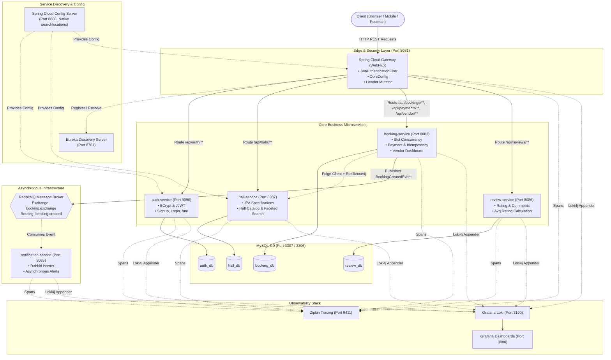
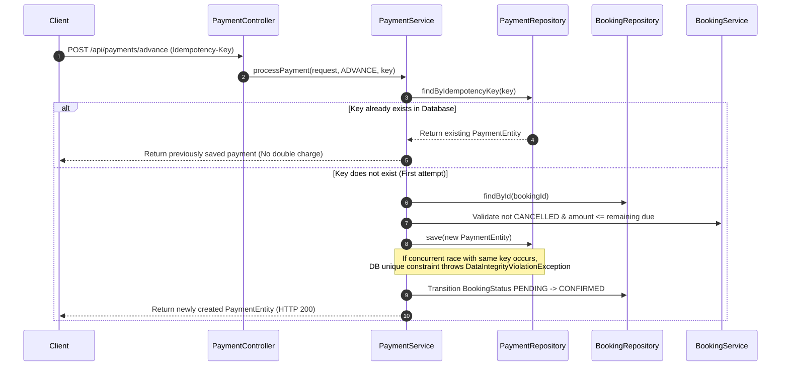
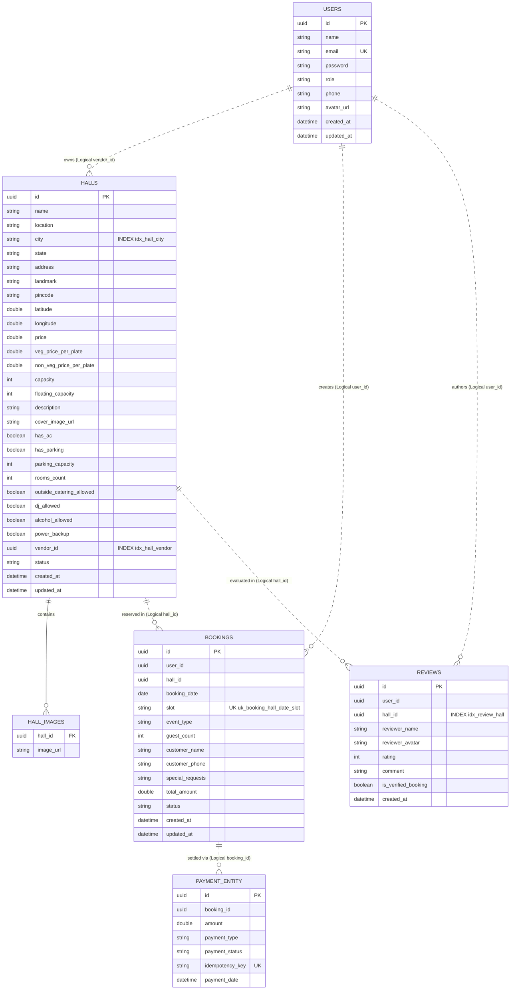
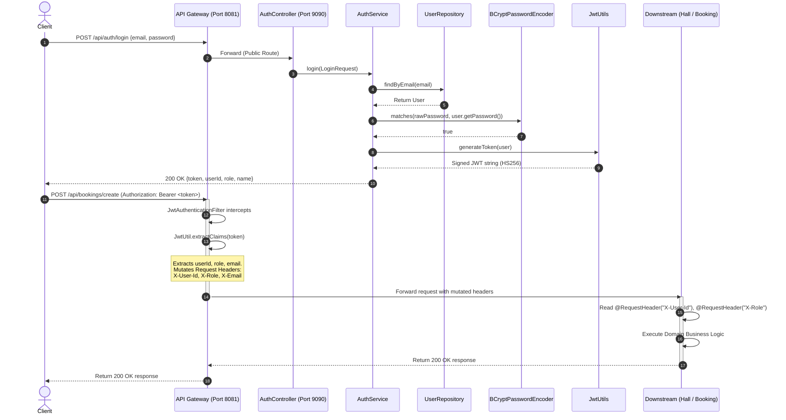

# MARRIAGE HALL BACKEND — COMPREHENSIVE ARCHITECT & INTERVIEW GUIDE

> **Project Name:** MarriageHall Microservices Platform  
> **Repository:** `Ravijaiswal047/Marriage-Hall-Backend`  
> **Target Frameworks:** Java 17 | Spring Boot 3.5.x | Spring Cloud 2025.x | Netflix Eureka | Spring Cloud Gateway (WebFlux) | OpenFeign | Resilience4j | Spring Data JPA | MySQL 8.0 | RabbitMQ | Micrometer & Zipkin | Loki & Grafana | Docker & Docker Compose | GitHub Actions  
> **Document Purpose:** Complete, production-grade technical interview preparation guide based strictly on the verified source code of this repository.

---

## TABLE OF CONTENTS

1. [Project Overview & Problem Statement](#1-project-overview)
2. [Interview Pitch Scripts (60s, 3-min, Senior Tech)](#2-interview-pitch-scripts)
3. [System Architecture & Topology](#3-system-architecture--topology)
4. [Service Discovery & Centralized Configuration](#4-service-discovery--centralized-configuration)
5. [API Gateway, Routing & Security Architecture](#5-api-gateway-routing--security-architecture)
6. [Authentication & User Management Service (`auth-service`)](#6-auth-service)
7. [Hall Catalog & Marketplace Service (`hall-service`)](#7-hall-service)
8. [Booking & Reservation Engine (`booking-service`)](#8-booking-service)
9. [Payment Processing & Idempotency Engine](#9-payment-processing--idempotency-engine)
10. [Vendor Analytics & Dashboard Module](#10-vendor-analytics--dashboard-module)
11. [Review & Social Proof Service (`review-service`)](#11-review-service)
12. [Asynchronous Messaging & Notification Service (`notification-service`)](#12-notification-service)
13. [End-to-End REST API Catalog](#13-end-to-end-rest-api-catalog)
14. [Database Architecture & Entity Relationship (ER) Model](#14-database-architecture--entity-relationship-er-model)
15. [JPA / Hibernate Mechanics & Optimization](#15-jpa--hibernate-mechanics--optimization)
16. [Spring Security & JWT Deep Dive](#16-spring-security--jwt-deep-dive)
17. [Inter-Service Communication, Resilience & Fault Tolerance](#17-inter-service-communication-resilience--fault-tolerance)
18. [Observability: Distributed Tracing, Metrics & Centralized Logging](#18-observability-distributed-tracing-metrics--centralized-logging)
19. [Docker Containerization & CI/CD Pipeline](#19-docker-containerization--cicd-pipeline)
20. [Class-by-Class & Method-by-Method Reference](#20-class-by-class--method-by-method-reference)
21. [End-to-End Request Execution Traces](#21-end-to-end-request-execution-traces)
22. [Business Rules & Concurrency Edge Cases](#22-business-rules--concurrency-edge-cases)
23. [Security & Performance Audit](#23-security--performance-audit)
24. [Design Patterns & Java 17 Features In Action](#24-design-patterns--java-17-features-in-action)
25. [205+ Comprehensive Interview Question Bank](#25-comprehensive-interview-question-bank)
26. [Technical Deep-Dive Answers & Follow-up Defense](#26-technical-deep-dive-answers--follow-up-defense)
27. [High-Pressure "Did You Really Build This?" Trap Questions](#27-high-pressure-trap-questions)
28. [Real-World Failure Scenarios & Troubleshooting](#28-real-world-failure-scenarios--troubleshooting)
29. [Honest Project Strengths, Limitations & Roadmap](#29-project-strengths-limitations--roadmap)
30. [Resume Bullet Points (ATS-Friendly)](#30-resume-bullet-points)
31. [Code Quality Scorecard](#31-code-quality-scorecard)
32. [Last-Minute Interview Revision Cheat Sheet](#32-last-minute-interview-revision-cheat-sheet)

---

# 1. PROJECT OVERVIEW

### What is MarriageHall?
**MarriageHall** is a cloud-native, distributed event-space marketplace and reservation backend engine built using **Spring Boot 3.5**, **Spring Cloud 2025**, and **Java 17**. It streamlines how event organizers discover marriage halls and banquet venues, evaluate venue amenities, verify real-time slot availability, execute reservations, process multi-stage payments (advance and final balance), and leave verified reviews. Concurrently, it empowers hall vendors with listing management, booking lifecycle administration, and revenue dashboards.

### What Problem Does It Solve?
1. **Double-Booking Elimination:** Traditional venues rely on manual registers or phone calls, resulting in frequent date/slot collisions. MarriageHall enforces slot-level concurrency controls via application validation and database unique constraints.
2. **Multi-Slot Scheduling:** Rather than coarse whole-day lockouts, venues can be reserved across distinct shift slots (`MORNING`, `EVENING`, or `FULL_DAY`).
3. **Payment Integrity & Idempotency:** Event deposits and final settlements are sensitive. The system guarantees that network retries or double-clicks do not double-charge customers using database-backed unique **Idempotency Keys**.
4. **Decoupled Asynchronous Notifications:** Reservation confirmations trigger downstream emails/SMS without delaying client HTTP response times via message brokers (**RabbitMQ**).
5. **Fault Isolation:** High traffic on public venue searches does not degrade checkout or booking transactions because domain workloads are segregated across independent microservices.

### Target Actors & Roles
The system defines 3 primary roles via the `Role` enum in `auth-service`:
* **`USER` / `CUSTOMER`:** Explores public venue listings, filters by location, pricing, and capacity; checks calendar availability; books venues; submits advance/final payments; posts verified reviews.
* **`VENDOR`:** Registers banquet halls; updates amenities, capacity, and pricing; monitors incoming customer reservations; tracks gross revenue, pending receipts, and outstanding balances on a dedicated vendor dashboard.
* **`ADMIN`:** Global oversight; access to override booking statuses and manage venues across all vendors.

---

# 2. INTERVIEW PITCH SCRIPTS

## 60–90 Second Pitch ("Tell me about your MarriageHall project")
> "I designed and built **MarriageHall**, a cloud-native microservices platform for banquet hall discovery, scheduling, and reservation management. The backend is powered by **Java 17, Spring Boot 3.5, and Spring Cloud 2025**. 
>
> To ensure high availability and clean domain boundaries, I decomposed the application into autonomous services: an **Auth Service** handling BCrypt hashing and JWT issuance; a **Hall Service** offering dynamic faceted search using JPA Specifications; a **Booking & Payment Service** supporting multi-slot bookings, advance/balance payments, and vendor analytics; a **Review Service** calculating running venue ratings; and an asynchronous **Notification Service**.
>
> All client traffic routes through a reactive **Spring Cloud Gateway**, which performs stateless JWT verification and propagates authenticated user context downstream via HTTP headers. Downstream inter-service calls use **OpenFeign** protected by **Resilience4j Circuit Breakers, Retries, and Rate Limiters**. Event decoupling is handled via **RabbitMQ**, while full observability is achieved using **Micrometer Tracing, Zipkin, and Grafana Loki**. To make deployment seamless, the entire stack is containerized with multi-stage Dockerfiles and automated using GitHub Actions."

---

## 3-Minute Comprehensive Walkthrough
> "In traditional event booking, two massive pain points are double bookings and brittle payment processing. For MarriageHall, I architected a distributed backend that directly targets these issues.
>
> At the perimeter sits **Netflix Eureka** for service discovery, a **Spring Cloud Config Server** providing centralized, runtime-refreshable configurations with `@RefreshScope`, and an asynchronous **Spring Cloud Gateway (WebFlux)** on port 8081. The gateway intercepts all inbound HTTP requests, verifies cryptographically signed HMAC-SHA256 JWT tokens, and transparently strips token overhead by mutating the request to forward lightweight `X-User-Id`, `X-Role`, and `X-Email` headers to internal microservices.
>
> When a user browses venues, the **Hall Service** uses JPA Specifications to build dynamic SQL queries on MySQL 8.0, filtering by city, price thresholds, and amenities like AC and parking. 
>
> When reserving, the **Booking Service** checks slot availability across `MORNING`, `EVENING`, and `FULL_DAY` slots. To prevent race conditions where two users attempt to book the same slot simultaneously, I implemented a defense-in-depth strategy: an initial application-level conflict check followed by an underlying database composite unique constraint on `(hall_id, booking_date, slot)`. If concurrent requests slip through, the database raises a `DataIntegrityViolationException`, which my Global Exception Handler gracefully converts to a 409 Conflict.
>
> For payments, I built an idempotency engine where every transaction requires an `Idempotency-Key` header. Duplicate attempts return the cached transaction rather than charging twice. Once booked, a domain event is published to **RabbitMQ**, allowing the **Notification Service** to consume messages asynchronously and deliver alerts without adding latency to the booking transaction.
>
> Inter-service queries between Booking and Hall services are managed via declarative **OpenFeign** clients protected by **Resilience4j** circuit breakers and rate limiters. Finally, the stack incorporates **Micrometer Tracing** with Zipkin and **Loki4j** log streaming into Grafana."

---

## Technical Senior Architect Explanation
> "Architecturally, MarriageHall follows a distributed, domain-driven microservices pattern adhering to 12-factor application methodology. 
>
> Data persistence is split into dedicated MySQL schemas per service (`auth_db`, `hall_db`, `booking_db`, `review_db`) to enforce loose coupling and prevent cross-domain database joins. The edge gateway uses non-blocking Netty-based Spring Cloud Gateway with a custom `GlobalFilter` for stateless authentication.
>
> For resilience, our synchronous inter-service communication over OpenFeign is guarded by a Resilience4j circuit breaker configured with a 10-call sliding window, a 50% failure threshold, and a 10-second open-state sleep window with exponential retries and rate limiters. This eliminates cascading thread starvation if the Hall catalog experiences latency.
>
> For state mutation reliability, we utilize transactional consistency inside domain boundaries and eventual consistency across domains via RabbitMQ Topic Exchanges (`booking.exchange`). Idempotency is enforced at the database level using unique hash indexes on incoming UUID transaction keys, guaranteeing strictly once-and-only-once payment semantics. Tracing correlation IDs (`traceId`, `spanId`) are automatically injected into Logback MDC via Brave and emitted to Grafana Loki, ensuring full end-to-end request auditability across network hops."

---

# 3. SYSTEM ARCHITECTURE & TOPOLOGY

The project is structured as a **Poly-repo-capable, Multi-module Maven Aggregator** containing 8 dedicated microservices, a shared config repository, and observability infrastructure:



---

# 4. SERVICE DISCOVERY & CENTRALIZED CONFIGURATION

### Service Discovery: `discovery-server`
* **File:** `discovery-server/src/main/java/com/marriagehall/discovery/DiscoveryServerApplication.java`
* **Port:** `8761`
* **Annotation:** `@EnableEurekaServer`
* **Configuration (`application.yaml`):**
  ```yaml
  server:
    port: 8761
  spring:
    application:
      name: discovery-server
  eureka:
    client:
      register-with-eureka: false
      fetch-registry: false
  ```
* **Why Register/Fetch is False:** Eureka Server is the registry authority itself; it does not need to register with or poll another peer in standalone mode.

### Centralized Config: `config-server`
* **File:** `config-server/src/main/java/com/marriagehall/config_server/ConfigServerApplication.java`
* **Port:** `8888`
* **Annotation:** `@EnableConfigServer`
* **Profile:** `native` (reads from local filesystem `/config-repo` or `classpath:/config`)
* **Central Properties File:** `config-repo/application.yml`
  ```yaml
  jwt:
    secret: <REDACTED>
  app:
    message: "Hello from Config Server - v1"
  ```
* **Client Integration:** Downstream services import configuration via:
  ```properties
  spring.config.import=optional:configserver:http://localhost:8888
  ```
* **Live Refresh Verification:** `hall-service` implements `RefreshDemoController.java` annotated with `@RefreshScope`. Calling `POST /actuator/refresh` triggers a dynamic context refresh of properties without requiring a service restart.

---

# 5. API GATEWAY, ROUTING & SECURITY ARCHITECTURE

### Module: `api-gateway` (Port `8081`)
Built on top of **Spring Cloud Gateway Server WebFlux** (Project Reactor & Netty).

#### Dynamic Routing Table
Configured in `api-gateway/src/main/resources/application.yaml`:
* `/api/auth/**` $\rightarrow$ `lb://AUTH-SERVICE`
* `/api/halls/**` $\rightarrow$ `lb://HALL-SERVICE`
* `/api/bookings/**` $\rightarrow$ `lb://BOOKING-SERVICE`
* `/api/payments/**` $\rightarrow$ `lb://BOOKING-SERVICE`
* `/api/vendor/**` $\rightarrow$ `lb://BOOKING-SERVICE`
* `/api/reviews/**` $\rightarrow$ `lb://REVIEW-SERVICE`

#### Security Architecture: The Gateway Interceptor Pattern
* **File:** `api-gateway/src/main/java/com/marriagehall/gateway/security/JwtAuthenticationFilter.java`
* **Type:** `GlobalFilter` (reactive `filter(ServerWebExchange, GatewayFilterChain)`)
* **Execution Flow:**
  1. **CORS Bypass:** If HTTP method is `OPTIONS`, immediately pass through.
  2. **Public Endpoint Check:** 
     * Whitelists `/api/auth/signup`, `/api/auth/login`, `/actuator/**`, `/swagger-ui/**`, `/v3/api-docs/**`.
     * Whitelists Public GET operations: `/api/halls/**` (except `/api/halls/vendor/**`), `/api/reviews/**`, `/api/bookings/availability/**`, `/api/bookings/check-availability/**`.
     * Allows unauthenticated guest browsing.
  3. **Token Extraction:** Verifies `Authorization` header begins with `Bearer `. If missing or malformed on protected routes, rejects immediately with `HttpStatus.UNAUTHORIZED (401)`.
  4. **Cryptographic Validation:** Parses claims using HMAC-SHA key generated from `jwt.secret`.
  5. **Header Mutation (Downstream Identity Propagation):**
     ```java
     ServerHttpRequest mutatedRequest = exchange.getRequest().mutate()
             .header("X-User-Id", userId)
             .header("X-Role", role)
             .header("X-Email", email)
             .build();
     return chain.filter(exchange.mutate().request(mutatedRequest).build());
     ```
     > **Architectural Significance:** Downstream services (`hall-service`, `booking-service`, `review-service`) do not need to parse JWT strings or connect to user databases. They receive verified identity parameters directly via trusted HTTP headers injected at the perimeter.

#### CORS Configuration
* **File:** `api-gateway/src/main/java/com/marriagehall/gateway/config/CorsConfig.java`
* Set to `@Order(Ordered.HIGHEST_PRECEDENCE)` to guarantee preflight `OPTIONS` requests are handled before security filters execute. Defaults cover ports 3000 (React/Next), 5173 (Vite), and 4200 (Angular).

---

# 6. AUTHENTICATION & USER MANAGEMENT SERVICE (`auth-service`)

* **Port:** `9090` | **Database:** `auth_db` | **Base Package:** `com.marriagehall.auth_service`
* **Purpose:** Handles user sign-up, credential verification, BCrypt password hashing, and signed JWT issuance.

### Data Model: `User`
* **Table:** `users`
* **Primary Key:** `id` (`UUID`, generated via Hibernate `@UuidGenerator`)
* **Fields:** `name` (String, not null), `email` (String, not null, unique), `password` (String, not null, BCrypt hash), `role` (`Role` enum: `USER`, `ADMIN`, `VENDOR`), `phone` (String), `avatarUrl` (String), `createdAt`, `updatedAt`.
* **Lifecycle Callbacks:** `@PrePersist` and `@PreUpdate` manage timestamps automatically.

### Key Workflows
1. **Registration (`POST /api/auth/signup`):**
   * Validates `SignupRequest`.
   * Checks `userRepository.findByEmail(email)`. Throws `EmailAlreadyExistsException` if present.
   * Encodes raw password with `BCryptPasswordEncoder`.
   * Catches `DataIntegrityViolationException` to eliminate race conditions between concurrent signups.
   * Emits JWT token and returns `AuthResponse` with HTTP 200.
2. **Login (`POST /api/auth/login`):**
   * Validates `LoginRequest`.
   * Locates user or throws `UserNotFoundException`.
   * Evaluates `passwordEncoder.matches(raw, hashed)`. Throws `InvalidCredentialsException` if false.
   * **Security Best Practice In Code:** In `GlobalExceptionHandler.java`, both `UserNotFoundException` and `InvalidCredentialsException` return identical HTTP 401 statuses and message `"Invalid email or password"` to prevent user enumeration attacks.
3. **Current Profile (`GET /api/auth/me`):**
   * Extracts user profile via `X-User-Id`, `X-Email`, fallback `Bearer` parsing, or `SecurityContextHolder`.

---

# 7. HALL CATALOG & MARKETPLACE SERVICE (`hall-service`)

* **Port:** `8087` | **Database:** `hall_db` | **Base Package:** `com.marriagehall.hall_service`
* **Purpose:** Manages the banquet hall lifecycle, vendor associations, capacity specifications, and marketplace search.

### Data Model: `Hall`
* **Table:** `halls`
* **Indexes:** `idx_hall_city` on `city`, `idx_hall_vendor` on `vendorId`.
* **Attributes:**
  * Identity & Location: `id` (UUID), `name`, `location`, `city`, `state`, `address`, `landmark`, `pincode`, `latitude`, `longitude`.
  * Pricing: `price` (base hall rental price), `vegPricePerPlate`, `nonVegPricePerPlate`.
  * Capacity: `capacity` (theater/seating), `floatingCapacity`, `parkingCapacity`, `roomsCount`.
  * Amenities: `hasAc`, `hasParking`, `outsideCateringAllowed`, `djAllowed`, `alcoholAllowed`, `powerBackup`.
  * Images: `@ElementCollection(fetch = FetchType.EAGER)` mapping strings to child table `hall_images` with join column `hall_id`.
  * Ownership: `vendorId` (UUID) mapping to the vendor user.
  * Status: `status` (defaults to `"ACTIVE"`, soft-deleted to `"INACTIVE"`).

### Dynamic Marketplace Filtering via JPA Specifications
In `HallService.java`:
```java
Specification<Hall> spec = (root, query, cb) -> {
    List<Predicate> predicates = new ArrayList<>();
    predicates.add(cb.equal(root.get("status"), "ACTIVE")); // Active filter

    if (city != null && !city.isBlank()) {
        String cityPattern = "%" + city.trim().toLowerCase() + "%";
        Predicate cityMatch = cb.like(cb.lower(root.get("city")), cityPattern);
        Predicate locationMatch = cb.like(cb.lower(root.get("location")), cityPattern);
        predicates.add(cb.or(cityMatch, locationMatch));
    }
    if (minPrice != null) predicates.add(cb.greaterThanOrEqualTo(root.get("price"), minPrice));
    if (maxPrice != null) predicates.add(cb.lessThanOrEqualTo(root.get("price"), maxPrice));
    if (minCapacity != null) predicates.add(cb.greaterThanOrEqualTo(root.get("capacity"), minCapacity));
    if (hasAc != null) predicates.add(cb.equal(root.get("hasAc"), hasAc));
    if (hasParking != null) predicates.add(cb.equal(root.get("hasParking"), hasParking));

    return cb.and(predicates.toArray(new Predicate[0]));
};
```
* Supports multi-param pagination and sorting (`PageRequest.of(page, size, sort)`).

---

# 8. BOOKING & RESERVATION ENGINE (`booking-service`)

* **Port:** `8082` | **Database:** `booking_db` | **Base Package:** `com.marriagehall.booking_service`
* **Purpose:** Handles venue slot scheduling, reservation state machines, calendar availability checks, and payment orchestration.

### Data Model: `Booking`
* **Table:** `bookings`
* **Critical Database Constraint:**
  ```java
  @Table(name = "bookings", uniqueConstraints = @UniqueConstraint(
          name = "uk_booking_hall_date_slot",
          columnNames = {"hallId", "bookingDate", "slot"}
  ))
  ```
* **Enums:**
  * `BookingSlot`: `MORNING`, `EVENING`, `FULL_DAY`.
  * `BookingStatus`: `PENDING`, `CONFIRMED`, `CANCELLED`.
  * `EventType`: `WEDDING`, `RECEPTION`, `ENGAGEMENT`, `BIRTHDAY`, `ANNIVERSARY`, `CORPORATE`, `OTHER`.

### Slot Conflict Logic
Implemented in `BookingService.createBooking()`:
* When booking slot `S` on date `D`:
  * Fetch existing bookings where `hallId = target` and `bookingDate = D`.
  * Exclude `CANCELLED` bookings.
  * Conflict arises if:
    1. Existing booking has `slot == FULL_DAY`.
    2. Requested booking has `slot == FULL_DAY`.
    3. Existing booking has `slot == requestedSlot`.
  * If a conflict is found, throws `BusinessRuleException`.
* If simultaneous requests pass application check, the database constraint `uk_booking_hall_date_slot` throws `DataIntegrityViolationException`, which is caught and re-thrown as a clean conflict exception.

---

# 9. PAYMENT PROCESSING & IDEMPOTENCY ENGINE

* **Subpackage:** `com.marriagehall.booking_service.payment`
* **Entity:** `PaymentEntity.java`
* **Enums:**
  * `PaymentType`: `ADVANCE`, `FINAL`, `REFUND`.
  * `PaymentStatus`: `SUCCESS`, `FAILED`, `PENDING`.

### The Idempotent Execution Algorithm
Every payment request (`POST /api/payments/advance` or `POST /api/payments/final`) requires an HTTP header:
`Idempotency-Key: <UUID-or-Unique-Client-String>`



---

# 10. VENDOR ANALYTICS & DASHBOARD MODULE

* **Subpackage:** `com.marriagehall.booking_service.dashboard`
* **Controller:** `VendorDashboardController.java`
* **Service:** `VendorDashboardService.java`
* **Role Verification:** Strictly requires `X-Role: VENDOR`.

### Aggregation Mechanics
1. Calls `HallServiceClient.getVendorHalls(vendorId)` over OpenFeign to discover all halls belonging to the vendor.
2. Performs a batch query on `BookingRepository`: `findByHallIdIn(hallIds)`.
3. Computes:
   * `totalHalls`: Count of vendor venues.
   * `totalBookings`, `pendingBookings`, `confirmedBookings`, `cancelledBookings`.
   * `totalRevenue`: Sum of `totalAmount` for all active bookings.
   * `receivedAmount`: Queries `PaymentRepository` for all successful payments (`PaymentStatus.SUCCESS`) across those bookings.
   * `dueAmount`: $\max(0.0, \text{totalRevenue} - \text{receivedAmount})$.

---

# 11. REVIEW & SOCIAL PROOF SERVICE (`review-service`)

* **Port:** `8086` | **Database:** `review_db` | **Base Package:** `com.marriagehall.review_service`
* **Entity:** `Review.java`
* **Table:** `reviews` with index `idx_review_hall` on `hallId`.
* **Fields:** `id` (UUID), `userId` (UUID), `hallId` (UUID), `reviewerName`, `reviewerAvatar`, `rating` (1 to 5, validated with `@Min(1)` and `@Max(5)`), `comment` (up to 2000 chars), `isVerifiedBooking` (Boolean), `createdAt`.
* **Repository:** `ReviewRepository.java`
  * `findByHallIdOrderByCreatedAtDesc(UUID hallId)`
  * Dynamic JPQL query for running rating average:
    ```sql
    SELECT AVG(r.rating) FROM Review r WHERE r.hallId = :hallId
    ```
* **Service Rating Aggregation:** Rounds average rating to one decimal place (`Math.round(avg * 10.0) / 10.0`).

---

# 12. NOTIFICATION SERVICE & ASYNCHRONOUS MESSAGING (`notification-service`)

* **Port:** `8085` | **Base Package:** `com.marriagehall.notification_service`
* **Broker:** RabbitMQ (AMQP on Port `5672`)
* **Exchange:** `booking.exchange` (TopicExchange)
* **Queue:** `booking.created.queue`
* **Routing Key:** `booking.created`
* **Message Serialization:** JSON via `Jackson2JsonMessageConverter`.

### Event-Driven Flow
1. When a reservation is saved in `BookingService`, a `BookingCreatedEvent` is emitted:
   ```java
   rabbitTemplate.convertAndSend("booking.exchange", "booking.created", event);
   ```
2. In `notification-service`, `BookingEventListener.java` listens via:
   ```java
   @RabbitListener(queues = "booking.created.queue")
   public void handleBookingCreated(BookingCreatedEvent event) {
       log.info("Notification -> Booking {} created for user {} (amount: {})...", 
           event.getBookingId(), event.getUserId(), event.getTotalAmount());
   }
   ```
3. Decouples notification delivery (email/SMS) from synchronous booking transactions.

---

# 13. END-TO-END REST API CATALOG

All requests (except Eureka/Config internal endpoints) route through the **API Gateway** (`http://localhost:8081`).

| Service | Method | Endpoint | Controller | Access Level | Description |
| :--- | :--- | :--- | :--- | :--- | :--- |
| **Auth** | `POST` | `/api/auth/signup` | `AuthController` | Public | Registers new user; returns JWT token & profile |
| **Auth** | `POST` | `/api/auth/login` | `AuthController` | Public | Authenticates credentials; returns JWT token |
| **Auth** | `GET` | `/api/auth/me` | `AuthController` | Authenticated | Retrieves current logged-in user profile |
| **Hall** | `GET` | `/api/halls` | `HallController` | Public | Paginated, filtered marketplace catalog of halls |
| **Hall** | `GET` | `/api/halls/cities` | `HallController` | Public | Distinct cities list for autocomplete filters |
| **Hall** | `GET` | `/api/halls/{hallId}` | `HallController` | Public | Retrieves specific venue specifications |
| **Hall** | `POST` | `/api/halls/create-hall` | `HallController` | `VENDOR` | Creates a new banquet hall listing |
| **Hall** | `PUT` | `/api/halls/{hallId}` | `HallController` | `VENDOR` / `ADMIN` | Updates venue details, capacity, and amenities |
| **Hall** | `DELETE` | `/api/halls/{hallId}` | `HallController` | `VENDOR` / `ADMIN` | Soft deletes venue (sets status to INACTIVE) |
| **Hall** | `GET` | `/api/halls/vendor/{vendorId}` | `HallController` | Authenticated | Retrieves all halls owned by specific vendor |
| **Hall** | `GET` | `/api/halls/config/message` | `RefreshDemoController` | Public | Verifies `@RefreshScope` dynamic config update |
| **Booking** | `POST` | `/api/bookings/create` | `BookingController` | `USER` / `ADMIN` | Creates venue booking with slot conflict check |
| **Booking** | `GET` | `/api/bookings/availability/{hallId}` | `BookingController` | Public | Real-time available slots for hall on date |
| **Booking** | `GET` | `/api/bookings/booked-dates/{hallId}` | `BookingController` | Public | Slot statuses across date range (for calendar) |
| **Booking** | `GET` | `/api/bookings/{bookingId}` | `BookingController` | Authenticated | Full booking details enriched with hall data |
| **Booking** | `GET` | `/api/bookings/{bookingId}/summary` | `BookingController` | Authenticated | Financial summary (paid, due, status) |
| **Booking** | `PUT` | `/api/bookings/{bookingId}/cancel` | `BookingController` | Authenticated | Cancels reservation |
| **Booking** | `PUT` | `/api/bookings/{bookingId}/status` | `BookingController` | `ADMIN` / Authorized | Updates status (`CONFIRMED`, `CANCELLED`) |
| **Booking** | `GET` | `/api/bookings/my-bookings` | `BookingController` | Authenticated | Retrieves reservations of current user |
| **Booking** | `GET` | `/api/bookings/user/{userId}` | `BookingController` | Authenticated | Retrieves bookings by specific user ID |
| **Payment** | `POST` | `/api/payments/advance` | `PaymentController` | Authenticated | Idempotent advance deposit payment |
| **Payment** | `POST` | `/api/payments/final` | `PaymentController` | Authenticated | Idempotent final settlement payment |
| **Dashboard** | `GET` | `/api/vendor/dashboard/stats` | `VendorDashboardController` | `VENDOR` | Aggregated stats (revenue, bookings, dues) |
| **Dashboard** | `GET` | `/api/vendor/dashboard/bookings` | `VendorDashboardController` | `VENDOR` | Detailed vendor booking list with financials |
| **Review** | `POST` | `/api/reviews/add` | `ReviewController` | Authenticated | Posts rating and review for venue |
| **Review** | `GET` | `/api/reviews/{hallId}` | `ReviewController` | Public | Retrieves all customer reviews for hall |
| **Review** | `GET` | `/api/reviews/{hallId}/average` | `ReviewController` | Public | Retrieves aggregated average rating (1.0 - 5.0) |

---

# 14. DATABASE ARCHITECTURE & ENTITY RELATIONSHIP (ER) MODEL

The architecture follows the **Database-per-Service** pattern to guarantee decoupling:
* `auth_db`: table `users`
* `hall_db`: tables `halls`, `hall_images`
* `booking_db`: tables `bookings`, `payment_entity`
* `review_db`: table `reviews`



---

# 15. JPA / HIBERNATE MECHANICS & OPTIMIZATION

### Annotations Used & Why
* **`@Entity` & `@Table`:** Defines persistent schema mapping. `@Table` defines explicit physical table names and indexes/unique constraints.
* **`@GeneratedValue` & `@UuidGenerator`:** Generates standard RFC 4122 UUID primary keys. This prevents primary key collision attacks and allows ID generation prior to database commit.
* **`@Enumerated(EnumType.STRING)`:** Persists enum names (e.g., `'CONFIRMED'`, `'FULL_DAY'`) as human-readable strings rather than ordinal integers. This prevents catastrophic database corruption if enum ordering changes.
* **`@ElementCollection(fetch = FetchType.EAGER)`:** Used on `Hall.images` to persist a list of strings into an associated table `hall_images` without requiring a full standalone entity.
* **`@PrePersist` & `@PreUpdate`:** Entity lifecycle hooks that automatically populate `createdAt` and `updatedAt` audit timestamps.
* **`@UniqueConstraint`:** Used on `Booking` (`hallId`, `bookingDate`, `slot`) and `PaymentEntity` (`idempotencyKey`) to guarantee strict transaction consistency.
* **`@Transactional(readOnly = true)`:** Applied to read operations. Optimizes Hibernate by disabling dirty-checking session snapshots and routing to read-replicas where supported.

---

# 16. SPRING SECURITY & JWT DEEP DIVE

### Authentication Sequence Diagram



### Interview Defense: "How does JWT authentication work in your project?"
> "Authentication in our platform is completely stateless. 
> 1. When a user authenticates via `/api/auth/login`, `AuthService` verifies credentials using BCrypt. Upon validation, `JwtUtils` generates a cryptographically signed HMAC-SHA256 token containing claims: `userId`, `role`, `sub` (email), `iat`, and `exp` (set to 1 hour).
> 2. On subsequent API calls, requests pass through our reactive **Spring Cloud Gateway**. 
> 3. Our custom `JwtAuthenticationFilter` intercepts the request, checks whether the endpoint is public, and validates the token signature against the shared secret served by Spring Cloud Config Server.
> 4. If valid, the gateway mutates the request by injecting `X-User-Id`, `X-Role`, and `X-Email` headers before proxying to downstream services.
> 5. This allows downstream services to remain lightweight, avoid redundant database lookups for user context, and enforce role-based access control directly from incoming headers."

---

# 17. INTER-SERVICE COMMUNICATION, RESILIENCE & FAULT TOLERANCE

### Synchronous Communication via OpenFeign
When `booking-service` needs venue pricing or vendor hall information, it uses declarative Feign interfaces:
* **Interface:** `booking-service/src/main/java/com/marriagehall/booking_service/client/HallClient.java`
  ```java
  @FeignClient(name = "HALL-SERVICE")
  public interface HallClient {
      @GetMapping("/api/halls/{hallId}")
      HallResponse getHallById(@PathVariable("hallId") UUID hallId);

      @GetMapping("/api/halls/vendor/{vendorId}")
      List<HallResponse> getVendorHalls(@PathVariable("vendorId") UUID vendorId);
  }
  ```

### Resilience4j Protection Layer
In `HallServiceClient.java`, all external calls are wrapped with **CircuitBreaker**, **Retry**, and **RateLimiter**:
```java
@CircuitBreaker(name = "hallService", fallbackMethod = "getHallFallback")
@Retry(name = "hallService")
@RateLimiter(name = "hallService")
public HallResponse getHallDetails(UUID hallId) {
    return hallClient.getHallById(hallId);
}

public HallResponse getHallFallback(UUID hallId, Throwable t) {
    log.error("Hall service call failed for hallId {}: {}", hallId, t.getMessage());
    throw new BusinessRuleException("Hall service is temporarily unavailable. Please try again shortly.");
}
```

#### Production Resilience Parameters (`application.properties`):
* **Sliding Window:** 10 calls.
* **Failure Threshold:** 50% (if 5 of 10 fail, the circuit opens).
* **Wait Duration in Open State:** 10 seconds before transitioning to Half-Open.
* **Permitted Calls in Half-Open:** 3 trial calls.
* **Retry Strategy:** Max 3 attempts, 1s interval on `FeignException`, `IOException`, `TimeoutException`.
* **Rate Limiter:** Max 5 calls per 1-second period.
* **Timeouts:** Connect timeout = 3000ms, Read timeout = 5000ms.

---

# 18. OBSERVABILITY: DISTRIBUTED TRACING, METRICS & CENTRALIZED LOGGING

The project implements full observability across logs, metrics, and traces:

1. **Distributed Tracing (Micrometer Tracing + Brave + Zipkin):**
   * Every request entering through the Gateway is assigned a unique `traceId`. Every service hop receives a unique `spanId`.
   * Tracing headers (`X-B3-TraceId`, `X-B3-SpanId`) propagate automatically via WebClient/Feign.
   * Spans are sent to Zipkin on `http://localhost:9411/api/v2/spans`.
2. **Centralized Logging (Loki4j + Grafana Loki):**
   * Configured via `logback-spring.xml` in every service.
   * `Loki4jAppender` streams structured logs directly over HTTP to Loki (`http://localhost:3100/loki/api/v1/push`).
   * Pattern: `%d{HH:mm:ss.SSS} [%thread] [${appName},%X{traceId:-},%X{spanId:-}] %-5level %logger{36} - %msg%n`.
   * Allows searching all logs across all 8 microservices in Grafana by `traceId`.
3. **Metrics & Actuator:**
   * Exposes `health`, `info`, `metrics`, `prometheus`, `circuitbreakers`, `retries`, `ratelimiters`.

---

# 19. DOCKER CONTAINERIZATION & CI/CD PIPELINE

### Multi-Stage Dockerfile Pattern
Present in every service (e.g., `booking-service/Dockerfile`):
* **Stage 1 (Build):** Base image `maven:3.9-eclipse-temurin-17`. Copies `pom.xml` and runs `mvn dependency:go-offline -B` to leverage Docker layer caching. Then copies `src` and builds jar with `-DskipTests`.
* **Stage 2 (Runtime):** Slim base image `eclipse-temurin:17-jre-alpine`. Copies only the packaged `app.jar`. Minimizes container footprint and attack surface.

### Docker Compose Stack
* **File:** `docker-compose.yml`
* Coordinates 12 containers: `mysql`, `discovery-server`, `config-server`, `rabbitmq`, `zipkin`, `loki`, `grafana`, `api-gateway`, `auth-service`, `hall-service`, `booking-service`, `review-service`, `notification-service`.
* Features explicit `healthcheck` dependencies (`service_healthy`) ensuring MySQL, Eureka, RabbitMQ, and Config Server initialize completely before downstream services launch.

### GitHub Actions CI/CD
* **File:** `.github/workflows/ci-cd.yml`
* **Job 1 (Build & Test Matrix):** Spawns a MySQL 8.0 service container and concurrently runs `mvn -B clean verify` across all 8 modules on every PR and push to `main`/`develop`.
* **Job 2 (Build & Push):** On merges to `main`, compiles multi-arch container images using Buildx and pushes them to GitHub Container Registry (`ghcr.io`) tagged with `:latest` and the commit SHA.

---

# 20. CLASS-BY-CLASS & METHOD-BY-METHOD REFERENCE

### Controller Layer
* **`AuthController` (`com.marriagehall.auth_service.controller`):**
  * `signup(SignupRequest)`: Validates body, invokes `authService.register`, returns `AuthResponse`.
  * `login(LoginRequest)`: Validates body, invokes `authService.login`, returns `AuthResponse`.
  * `getCurrentUser(...)`: Extracts profile using gateway headers or security context.
* **`HallController` (`com.marriagehall.hall_service.controller`):**
  * `getAllHalls(...)`: Accepts query parameters (`city`, `minPrice`, `maxPrice`, `minCapacity`, `hasAc`, `hasParking`, `page`, `size`, `sortBy`, `direction`), converts to `Pageable`, returns `Page<Hall>`.
  * `createHall(HallRequest, vendorId, role)`: Reads headers injected by gateway; delegates to `hallService.createHall`.
  * `getHallById(UUID)`: Fetches venue details.
  * `getVendorHalls(UUID)`: Fetches all venues for a vendor.
  * `updateHall(UUID, HallRequest, vendorId, role)`: Updates venue details with ownership checks.
  * `deleteHall(UUID, vendorId, role)`: Soft deletes venue.
* **`BookingController` (`com.marriagehall.booking_service.controller`):**
  * `create(BookingRequest, userId, role)`: Creates a reservation after slot conflict validation.
  * `checkAvailability(UUID, LocalDate)`: Public endpoint calculating booked vs available slots.
  * `getBookedDates(UUID, LocalDate, LocalDate)`: Aggregates booked slot states across date ranges for calendar views.
  * `getBooking(UUID)`: Enriches booking with hall data via OpenFeign.
  * `getBookingSummary(UUID)`: Returns financial metrics (`totalAmount`, `paidAmount`, `dueAmount`).
  * `cancelBooking(UUID)`: Cancels booking.
* **`PaymentController` (`com.marriagehall.booking_service.payment`):**
  * `payAdvance(PaymentRequestDTO, idempotencyKey)`: Executes advance payment.
  * `payFinal(PaymentRequestDTO, idempotencyKey)`: Executes final balance payment.
* **`VendorDashboardController` (`com.marriagehall.booking_service.dashboard.controller`):**
  * `getStats(vendorId, role)`: Aggregates revenue, bookings, and pending dues for a vendor.
  * `getBookings(vendorId, role)`: Lists all reservations across vendor halls.
* **`ReviewController` (`com.marriagehall.review_service.controller`):**
  * `createReview(ReviewRequest, userId, email)`: Submits rating and review.
  * `getReview(UUID hallId)`: Returns reviews ordered newest first.
  * `averageRating(UUID hallId)`: Returns calculated average rating.

---

# 21. END-TO-END REQUEST EXECUTION TRACES

### Request Trace: `POST /api/bookings/create`
```text
[Client]
   ↓ (Sends POST /api/bookings/create with JWT Bearer token)
[API Gateway : JwtAuthenticationFilter]
   ↓ (Validates JWT signature & expiry via JwtUtil)
   ↓ (Extracts userId & role; mutates request with X-User-Id and X-Role headers)
[BookingController.create()]
   ↓ (Validates @Valid BookingRequest: future date, non-null hallId)
[BookingService.createBooking()]
   ↓ (Verifies role is USER, CUSTOMER, or ADMIN)
   ↓ (Queries BookingRepository: findByHallIdAndBookingDate)
   ↓ (Evaluates slot collision against existing non-cancelled bookings)
   ↓ (Calls HallServiceClient.getHallDetails() via OpenFeign + Resilience4j)
   ↓ (Builds Booking entity with status=PENDING, totalAmount=hall.price)
   ↓ (Executes bookingRepository.save(booking))
   ↓ [DB: catches potential DataIntegrityViolationException on uk_booking_hall_date_slot]
   ↓ (Emits BookingCreatedEvent to RabbitMQ topic exchange)
[Response]
   ↓ (Returns saved Booking entity with HTTP 200 OK)
```

---

# 22. BUSINESS RULES & CONCURRENCY EDGE CASES

| Business Rule | Implementation Location | Failure Behavior |
| :--- | :--- | :--- |
| **Only Vendors Can Create Halls** | `HallService.createHall()` | Throws `ForbiddenException("Only vendors can create halls")` $\rightarrow$ 403 Forbidden |
| **Venue Update / Delete Authorization** | `HallService.updateHall()` | Verifies caller is ADMIN or matches `hall.getVendorId()` $\rightarrow$ Throws 403 Forbidden |
| **Soft Delete on Venues** | `HallService.deleteHall()` | Updates `status = 'INACTIVE'`; preserves historical booking references |
| **Slot Booking Conflict** | `BookingService.createBooking()` | Checks slot overlap against active bookings $\rightarrow$ Throws `BusinessRuleException` $\rightarrow$ 409 Conflict |
| **Database Slot Collision Safety Net** | `Booking.uk_booking_hall_date_slot` | Catches `DataIntegrityViolationException` $\rightarrow$ Throws `BusinessRuleException` $\rightarrow$ 409 Conflict |
| **Payment Idempotency** | `PaymentService.processPayment()` | If `idempotencyKey` exists, returns original transaction; DB unique key prevents concurrent duplicates |
| **Overpayment Prevention** | `PaymentService.processPayment()` | Checks `alreadyPaid + amount > totalAmount` $\rightarrow$ Throws `BusinessRuleException` $\rightarrow$ 409 Conflict |
| **Payment Auto-Confirmation** | `PaymentService.processPayment()` | If booking is in `PENDING` state, payment automatically transitions it to `CONFIRMED` |
| **No Payment on Cancelled Booking** | `PaymentService.processPayment()` | Throws `BusinessRuleException("Cannot process payment for a cancelled booking")` |

---

# 23. SECURITY & PERFORMANCE AUDIT

### Security Findings & Architecture Review
1. **Password Security (GOOD):** BCrypt with salt is implemented via `BCryptPasswordEncoder`.
2. **User Enumeration Defense (GOOD):** Login errors return identical generic 401 messages whether the user does not exist or the password fails.
3. **Perimeter Authentication (GOOD):** Centralized JWT verification at Gateway removes token parsing overhead from internal business services.
4. **Idempotency Protection (GOOD):** Database-backed unique keys prevent replay attacks and accidental duplicate charges.
5. **Secret Hardcoding (RISK FOUND):** Default JWT secret is present as a fallback in `application.properties` and `config-repo`. *Interview recommendation: In production, enforce secrets injection strictly via environment variables or HashiCorp Vault.*
6. **Internal Header Spoofing (RISK FOUND):** If internal microservice ports are exposed publicly, an attacker could forge `X-User-Id` and `X-Role`. *Interview recommendation: Restrict internal service ports to private Docker networks and enforce mutual TLS (mTLS) or gateway token signing.*

### Performance Audit
1. **Dynamic Specifications (GOOD):** Index-backed JPA Specifications prevent loading entire database tables into JVM memory.
2. **Read-Only Transactions (GOOD):** `@Transactional(readOnly = true)` disables unnecessary Hibernate session dirty-checking.
3. **Eager Collection Fetching (NEEDS IMPROVEMENT):** `Hall.images` uses `@ElementCollection(fetch = FetchType.EAGER)`. For large image lists, this can cause N+1 overhead or join duplication. *Recommendation: Convert to lazy loading or dedicated image sub-entities with pagination.*
4. **Caching Opportunity (FUTURE IMPROVEMENT):** Public marketplace venue searches hit MySQL directly. Introducing Redis caching for `searchHalls` and `getDistinctCities` would significantly decrease database load.

---

# 24. DESIGN PATTERNS & JAVA 17 FEATURES IN ACTION

### Design Patterns
* **API Gateway Pattern:** Unified edge entry point for routing, SSL termination, and token inspection.
* **Database-per-Service:** Enforces strict domain separation and data encapsulation across microservices.
* **Circuit Breaker & Retry Patterns:** Fault tolerance via Resilience4j to avoid cascading service failures.
* **Idempotent Consumer / Receiver:** Guarantees safe retries for financial payment transactions.
* **Publisher-Subscriber (Event-Driven):** Decouples booking persistence from notification delivery via RabbitMQ.
* **Repository Pattern & Specification Pattern:** Clean abstraction over database access and dynamic predicate construction.
* **Builder Pattern:** Fluent entity and DTO instantiation via Lombok `@Builder`.

### Java 17 Concepts Used
* **Stream API & Lambdas:** Used extensively for financial aggregations, mapping collections, and grouping slots.
* **Java Time API (`java.time.*`):** Strict usage of `LocalDate` and `LocalDateTime` instead of legacy `java.util.Date`.
* **UUID Implementation:** RFC 4122 native UUID identifiers for entities.
* **Records / Modern Constructors:** Constructor injection via Lombok `@RequiredArgsConstructor`.

---

# 25. COMPREHENSIVE INTERVIEW QUESTION BANK (205+ QUESTIONS)

### Category 1: Beginner Level (20 Questions)
1. What is Spring Boot, and why did you choose it for the MarriageHall project?
2. What is the difference between `@RestController` and `@Controller`?
3. How does Spring Boot auto-configuration work behind the scenes?
4. What role does `pom.xml` play in a Maven multi-module aggregator project?
5. What is the purpose of the `@SpringBootApplication` annotation?
6. Explain Dependency Injection (DI) and Inversion of Control (IoC) with an example from this project.
7. Why is constructor injection preferred over field injection (`@Autowired`)?
8. What is the role of Lombok annotations like `@Data`, `@Builder`, and `@RequiredArgsConstructor`?
9. What is the difference between `GET`, `POST`, `PUT`, and `DELETE` HTTP methods?
10. What are Spring Boot starter dependencies (e.g., `spring-boot-starter-web`)?
11. What is the functional difference between `application.properties` and `application.yml`?
12. What is JPA, and how does it relate to Hibernate?
13. What is the purpose of `@Entity` and `@Table` in JPA?
14. What does `@Id` and `@GeneratedValue` do in entity classes?
15. What is a DTO (Data Transfer Object), and why should entities not be exposed directly to clients?
16. What is the purpose of Bean Validation annotations like `@NotNull`, `@NotBlank`, and `@Size`?
17. What is an exception handler in Spring Boot, and how does `@ExceptionHandler` work?
18. What is Maven dependency management and `<dependencyManagement>`?
19. What is Git, and what was your branching and commit strategy for this project?
20. How do you run the MarriageHall application locally from the terminal or IDE?

### Category 2: Intermediate Level (30 Questions)
21. Explain the architectural difference between a monolith and microservices.
22. How does service discovery work using Netflix Eureka in this platform?
23. Why did you configure `register-with-eureka: false` and `fetch-registry: false` in `discovery-server`?
24. What is Spring Cloud Gateway, and how does it differ from legacy Netflix Zuul?
25. How does Spring Cloud Gateway route incoming requests to downstream services?
26. What is the purpose and meaning of `lb://SERVICE-NAME` in gateway routing definitions?
27. Explain how `GlobalFilter` operates in Spring Cloud Gateway.
28. How does `CorsConfig` in `api-gateway` handle CORS preflight `OPTIONS` requests?
29. How does `auth-service` securely store user passwords using BCrypt?
30. Why is BCrypt preferred over MD5 or SHA-256 for password hashing?
31. What are the three parts of a JSON Web Token (JWT)?
32. What specific claims are embedded inside the JWT in this project?
33. How does the API Gateway propagate authenticated user context to downstream microservices?
34. What is Spring Cloud Config Server, and why is centralized configuration valuable?
35. How does `@RefreshScope` work when updating properties dynamically at runtime?
36. What happens if Spring Cloud Config Server is temporarily unavailable during service boot?
37. What are JPA Specifications, and how are they used for dynamic filtering in `hall-service`?
38. Explain the difference between `JpaRepository` and `JpaSpecificationExecutor`.
39. How does pagination and sorting work in `hall-service` using `Pageable` and `Page<Hall>`?
40. What is an `@ElementCollection` in JPA, and how is it used for `Hall.images`?
41. What is the difference between `FetchType.LAZY` and `FetchType.EAGER`?
42. How does `@Transactional(readOnly = true)` optimize Hibernate database queries?
43. What is the purpose of `@PrePersist` and `@PreUpdate` entity lifecycle callbacks?
44. How does `booking-service` detect venue slot conflicts before creating a reservation?
45. What are the three venue shift slots supported by the platform?
46. What happens if a user attempts to book a `FULL_DAY` slot when `MORNING` is already reserved?
47. How does the system handle booking cancellations, and what state transition occurs?
48. What is an Idempotency Key, and why is it critical for financial transactions?
49. How does `PaymentService` prevent double-charging a customer on network retries?
50. How does the system transition booking status upon receiving a successful payment?

### Category 3: Advanced Architecture & Concurrency (30 Questions)
51. How does Resilience4j Circuit Breaker operate within `booking-service`?
52. Explain the three states of a Circuit Breaker: CLOSED, OPEN, and HALF-OPEN.
53. What specific parameters did you configure for Resilience4j in `booking-service`'s `application.properties`?
54. What is the purpose of a fallback method in OpenFeign calls, and what should it return?
55. What is the operational difference between a Circuit Breaker, a Retry, and a Rate Limiter?
56. How does RabbitMQ decouple the `notification-service` from `booking-service`?
57. What exchange type is used for booking notifications (`TopicExchange`), and why?
58. What happens if RabbitMQ is unavailable when a booking transaction is committed?
59. How does distributed tracing work across microservices using Micrometer Tracing, Brave, and Zipkin?
60. What is the architectural difference between a `traceId` and a `spanId`?
61. How does Loki4j stream structured Logback logs directly to Grafana Loki?
62. How do you correlate distributed traces in Zipkin with application logs in Grafana?
63. Explain the multi-stage Docker build pattern used across all microservices.
64. Why is `mvn dependency:go-offline` executed in a dedicated Docker build layer?
65. What security and memory advantages come from using `eclipse-temurin:17-jre-alpine`?
66. How does `docker-compose.yml` coordinate startup ordering using health checks?
67. What is the GitHub Actions CI/CD matrix build strategy implemented in `.github/workflows/ci-cd.yml`?
68. How does the CI pipeline execute integration tests against a real MySQL service container?
69. What are the architectural trade-offs of the Database-per-Service pattern?
70. How do you achieve data consistency across microservices without distributed 2-Phase Commit (2PC)?
71. How would you handle a distributed failure where payment succeeds but booking update fails?
72. What is the N+1 select problem in Hibernate, and where could it occur in this project?
73. How does the unique database constraint on `bookings` resolve high-concurrency race conditions?
74. Why is catching `DataIntegrityViolationException` necessary in `AuthService` and `BookingService`?
75. How does the authentication system defend against user enumeration attacks during login?
76. What is the architectural vulnerability of relying exclusively on HTTP headers for user context?
77. How would you secure inter-service network communication in a zero-trust production environment?
78. How does `VendorDashboardService` aggregate financial metrics across multiple venues?
79. What database indexes are configured in this codebase, and why were those columns chosen?
80. How would you introduce Redis caching into the hall search workflow to maximize throughput?

### Category 4: Spring Boot Deep-Dive (20 Questions)
81. Explain the Spring Boot bootstrap lifecycle from `main()` to application ready state.
82. What three annotations compose `@SpringBootApplication` (`@Configuration`, `@EnableAutoConfiguration`, `@ComponentScan`)?
83. What is the difference between `@Component`, `@Service`, `@Repository`, and `@Configuration` in Spring IoC?
84. How does Spring Boot resolve `@Value("${app.cors.allowed-origins:http://localhost:3000}")` with default fallbacks?
85. What role does `spring-boot-starter-validation` play during controller request binding?
86. How does `@RestControllerAdvice` intercept exceptions across controllers globally?
87. What is Spring Boot Actuator, and which endpoints are exposed in this platform?
88. How does Spring Boot configure HikariCP connection pooling by default?
89. What is relaxed property binding in Spring Boot configuration management?
90. Why is `@Builder.Default` necessary when using Lombok's `@Builder` on entities with default values?
91. How does Spring Boot WebFlux handle HTTP requests without standard servlet threads?
92. What is the purpose of `spring-boot-maven-plugin` during the packaging phase?
93. How does Spring Boot handle JSON serialization for Java 8/17 date types (`LocalDate`)?
94. How does `@DateTimeFormat(iso = DateTimeFormat.ISO.DATE)` parse incoming request parameters?
95. What is the difference between `application.properties` and bootstrap properties in Spring Cloud?
96. How does Spring Boot manage graceful shutdown in containerized environments?
97. How does constructor injection with Lombok `@RequiredArgsConstructor` ensure immutability?
98. What is the role of `spring-cloud-starter-config` in client bootstrapping?
99. How does `springdoc-openapi-starter-webmvc-ui` auto-generate Swagger documentation?
100. How do environment variables in Docker Compose override properties defined in `application.properties`?

### Category 5: Spring Security & JWT (20 Questions)
101. What is the difference between `SecurityWebFilterChain` in reactive gateway vs `SecurityFilterChain` in servlet MVC?
102. Why is CSRF protection disabled in stateless REST microservices?
103. How does `JwtAuthenticationFilter` in `api-gateway` determine which endpoints are public?
104. What happens when a request without a `Bearer` token hits a protected route like `/api/bookings/create`?
105. How does `JwtUtils` construct the signing key using `Keys.hmacShaKeyFor()`?
106. What cryptographic algorithm is used to sign JWTs in this platform (`HS256`)?
107. How is token expiration calculated and validated in `JwtUtils`?
108. Why does `api-gateway` parse claims once instead of calling separate extraction methods?
109. What headers does `JwtAuthenticationFilter` inject into mutated downstream requests?
110. How does `auth-service`'s `JwtFilter` populate the `SecurityContextHolder`?
111. Why does `auth-service` pass `Collections.emptyList()` to `UsernamePasswordAuthenticationToken`?
112. How does `AuthController.getCurrentUser()` retrieve user identity from headers vs security context?
113. What is the security advantage of using BCrypt over standard SHA-256 for password storage?
114. How does BCrypt handle salt generation internally?
115. Why does `GlobalExceptionHandler` return identical error responses for invalid passwords and missing users?
116. How would you implement JWT token refresh or token revocation in this architecture?
117. What is the difference between role-based access control (RBAC) and attribute-based access control (ABAC)?
118. How is the `Role` enum mapped into JWT claims and validated in `BookingService`?
119. What happens if an expired JWT token is passed to `api-gateway`?
120. How would you prevent replay attacks if a JWT token is intercepted over HTTP?

### Category 6: JPA & Hibernate (20 Questions)
121. What is the purpose of Hibernate's `@UuidGenerator` on entity IDs?
122. How does `@Enumerated(EnumType.STRING)` prevent database corruption compared to `EnumType.ORDINAL`?
123. What underlying SQL table is generated by `@ElementCollection` and `@CollectionTable` in `Hall.java`?
124. Why is `FetchType.EAGER` used on `hall_images`, and what are its performance implications?
125. How do `@PrePersist` and `@PreUpdate` callbacks work in `User`, `Hall`, `Booking`, and `PaymentEntity`?
126. What is the role of `JpaSpecificationExecutor<Hall>` in dynamic search queries?
127. How does `CriteriaBuilder` construct `cb.like` and `cb.lower` for case-insensitive search in `HallService`?
128. What is the difference between `cb.or()` and `cb.and()` in JPA predicate composition?
129. How does `PageRequest.of(page, size, sort)` generate SQL `LIMIT` and `OFFSET` clauses?
130. What is dirty checking in Hibernate session management, and how does `readOnly = true` disable it?
131. How does Spring Data JPA derive query methods like `findByHallIdAndBookingDate()`?
132. What is the JPQL query used in `ReviewRepository` to compute `getAverageRating()`?
133. How does `BookingRepository.findByHallIdIn(List<UUID>)` generate an SQL `IN` query?
134. What happens if an entity is saved without an active transaction in Spring Data JPA?
135. What is the difference between `save()` and `saveAndFlush()` in Spring Data JPA?
136. How does Hibernate manage the first-level (L1) cache during service method execution?
137. What causes `DataIntegrityViolationException` when inserting duplicate booking records?
138. How does `spring.jpa.hibernate.ddl-auto=update` behave in development vs production?
139. Why should production systems avoid `ddl-auto=update` in favor of migration tools like Flyway or Liquibase?
140. How does soft deletion in `HallService.deleteHall()` preserve historical foreign relations?

### Category 7: Microservices & Cloud (20 Questions)
141. How does Netflix Eureka manage client heartbeats and eviction of dead instances?
142. What is the difference between client-side load balancing and server-side load balancing?
143. How does Spring Cloud LoadBalancer integrate with Eureka and OpenFeign?
144. What happens when Eureka registry cache expires on the API Gateway?
145. How does Spring Cloud Config Server fetch configuration using the `native` profile?
146. What HTTP endpoint is called on client microservices to trigger `@RefreshScope` reload?
147. What is the difference between Spring Cloud Config native repository and Git repository?
148. Why does `application.properties` use `optional:configserver:http://localhost:8888`?
149. How does Resilience4j Circuit Breaker transition from OPEN to HALF-OPEN state?
150. What constitutes a failure according to `resilience4j.circuitbreaker.failure-rate-threshold`?
151. How does Resilience4j RateLimiter enforce request limits on `hallService` calls?
152. What exceptions trigger automatic retry in `resilience4j.retry.retry-exceptions`?
153. How does OpenFeign serialize method parameters into HTTP GET query parameters?
154. What is the purpose of `RabbitMQConfig.TopicExchange` in event-driven architecture?
155. How does a RabbitMQ Binding connect a Queue to a TopicExchange via Routing Key?
156. Why is `Jackson2JsonMessageConverter` required for RabbitMQ messaging?
157. What is the role of `@RabbitListener` in `notification-service`?
158. How do you handle dead-letter exchanges (DLX) in RabbitMQ when consumer message processing fails?
159. What are the CAP theorem trade-offs made in this microservices architecture?
160. How does database-per-service prevent distributed monolithic coupling?

### Category 8: SQL & Database Design (15 Questions)
161. What database engine is used in MySQL 8.0, and why is InnoDB preferred?
162. Explain the purpose of composite unique index `uk_booking_hall_date_slot`.
163. Why are indexes created on `city` and `vendorId` in the `halls` table?
164. What is the performance impact of missing indexes on foreign key columns?
165. Why is `idempotencyKey` set to `unique = true` in `payment_entity`?
166. What data types are used for storing monetary amounts (`Double` vs `BigDecimal`), and what is the trade-off?
167. How does MySQL handle UUID storage (`CHAR(36)` vs `BINARY(16)`)?
168. What isolation level does MySQL InnoDB use by default (Repeatable Read)?
169. How does MySQL handle concurrent inserts on unique constraint violations?
170. Explain the schema of the child table `hall_images` created by `@ElementCollection`.
171. How does `ReviewRepository.getAverageRating()` handle halls with zero reviews (null handling)?
172. What is the difference between a clustered index and a secondary index in MySQL InnoDB?
173. How would you optimize the `bookings` table for queries filtering by date ranges?
174. Why are audit timestamps (`createdAt`, `updatedAt`) essential in database design?
175. How does connection pooling with HikariCP reuse database connections efficiently?

### Category 9: Project-Specific Deep Dive (30 Questions)
176. Explain the exact execution workflow of `BookingService.createBooking()` step-by-step.
177. How does `BookingService` handle slot conflict between `FULL_DAY` and `MORNING`?
178. What happens if two users try to book `MORNING` and `EVENING` slots for the same hall on the same date?
179. How does `BookingService.checkAvailability()` determine available slots for a hall?
180. What data structure does `getBookedDates()` return for the frontend interactive calendar?
181. How does `BookingDetailResponse` combine data from two different microservices?
182. What calculations are performed in `BookingService.getBookingSummary()`?
183. How does `PaymentService.processPayment()` prevent overpaying beyond the total booking amount?
184. What happens when a booking transitions from `PENDING` to `CONFIRMED`?
185. Can a customer pay for a cancelled booking, and where is that blocked?
186. How does `VendorDashboardService` calculate `totalRevenue` vs `receivedAmount` vs `dueAmount`?
187. What happens if a vendor has no halls registered when visiting the dashboard?
188. How does `HallService.createHall()` extract vendor identity from gateway headers?
189. How does `HallService.updateHall()` verify that the caller owns the hall being modified?
190. Why does `HallService.deleteHall()` perform a soft delete instead of a hard delete?
191. What distinct cities query is executed by `HallRepository.findDistinctCities()`?
192. How does `ReviewService.createReview()` assign fallback names for anonymous or verified guests?
193. Why is `isVerifiedBooking` set to `true` by default in the `Review` entity?
194. How does `MissingRequestHeaderException` in `review-service` detect gateway bypass attempts?
195. What payload does `BookingCreatedEvent` carry across RabbitMQ?
196. How does `NotificationService` consume `BookingCreatedEvent` without knowing about MySQL?
197. What is the role of `OpenApiConfig` in `auth-service`, `hall-service`, `booking-service`, and `review-service`?
198. How does `CorsConfig` in `api-gateway` support multiple frontend environments (Vite, React, Angular)?
199. What is the purpose of `RefreshDemoController` in `hall-service`?
200. How does Docker Compose ensure that MySQL is ready before `auth-service` attempts to connect?
201. Why does GitHub Actions CI run a MySQL container during test execution?
202. What environment variables are required to deploy the stack in a production environment?
203. How does Loki4j format logs with context variables `${appName}`, `%X{traceId}`, and `%X{spanId}`?
204. What would happen to the platform if `config-server` went down after services have already booted?
205. If you had one week to refactor this codebase before commercial launch, what 3 changes would you prioritize?

---

# 26. TECHNICAL DEEP-DIVE ANSWERS & FOLLOW-UP DEFENSE

### Q1: "How do you prevent double bookings when two users submit requests for the same hall and slot at the exact same millisecond?"
* **Short Answer:** We use a two-tiered defense: an application-level conflict check in `BookingService`, backed by a database-level composite unique constraint `uk_booking_hall_date_slot` on `(hallId, bookingDate, slot)`.
* **Detailed Technical Answer:** In `BookingService.createBooking()`, the application first queries `bookingRepository.findByHallIdAndBookingDate()`. It checks if an active booking exists with overlapping slots (`FULL_DAY` vs `MORNING`/`EVENING`). If two concurrent HTTP requests pass this check simultaneously due to transaction isolation, both attempt to insert into MySQL. MySQL evaluates the unique key constraint `uk_booking_hall_date_slot`. One insert succeeds, while the other is rejected with a `DataIntegrityViolationException`. Our service catches this exception and converts it into a `BusinessRuleException`, returning an HTTP 409 Conflict.
* **Where It Exists:** `booking-service/src/main/java/com/marriagehall/booking_service/entity/Booking.java` & `booking-service/src/main/java/com/marriagehall/booking_service/service/BookingService.java`.
* **Follow-up Question:** *"What if user A books MORNING and user B books FULL_DAY at the exact same time? The unique constraint on (hallId, bookingDate, slot) won't catch that because 'MORNING' != 'FULL_DAY'!"*
* **Strong Answer:** *"That is an acute observation of the composite key constraint. In the current implementation, slot conflicts between different values (like FULL_DAY vs MORNING) are caught by the application-level loop in `createBooking()`. However, to make this 100% race-condition-proof under extreme concurrency, in production I would either: (1) acquire a database pessimistic write lock (`SELECT ... FOR UPDATE`) on a parent Hall reservation calendar table, (2) use a distributed lock via Redis Redisson on the key `lock:hall:{hallId}:date:{bookingDate}`, or (3) normalize slot occupancy into two discrete boolean slot records (`morning_booked`, `evening_booked`) in a single row per date."*

---

### Q2: "How does payment idempotency work in your project?"
* **Short Answer:** Every payment request requires an `Idempotency-Key` header. The system checks if that key has already been processed; if so, it returns the cached payment record without re-charging.
* **Detailed Technical Answer:** In `PaymentService.processPayment()`, the service validates the `Idempotency-Key`. It performs a lookup via `paymentRepository.findByIdempotencyKey(key)`. If present, it immediately returns the existing `PaymentEntity`. If not present, it validates that the booking is active and that `alreadyPaid + requestedAmount <= totalAmount`. It saves the new payment with status `SUCCESS` and unique `idempotencyKey`. If two concurrent requests arrive with the same key, MySQL's unique constraint blocks the second insert with a `DataIntegrityViolationException`, prompting the catch block to fetch and return the winning record.
* **Where It Exists:** `booking-service/src/main/java/com/marriagehall/booking_service/payment/PaymentEntity.java` & `booking-service/src/main/java/com/marriagehall/booking_service/payment/PaymentService.java`.
* **Follow-up Question:** *"What happens if a client submits an idempotency key, the transaction crashes midway before saving, and the client retries?"*
* **Strong Answer:** *"Because the operation is wrapped in `@Transactional`, any mid-flight failure rolls back the entire database transaction, meaning no partial record is saved. When the client retries with the same idempotency key, the key is not in the database, allowing the transaction to execute freshly and cleanly."*

---

### Q3: "Why did you choose an API Gateway instead of letting clients call microservices directly?"
* **Short Answer:** It centralizes authentication, eliminates CORS complexity, conceals internal service topology, and provides single-point observability.
* **Detailed Technical Answer:** Without an API Gateway, the frontend would need to discover and manage connections to 5+ distinct service ports. Each service would redundantly parse JWTs and require CORS configuration. With Spring Cloud Gateway, clients send requests exclusively to port 8081. The gateway executes token validation once, injects `X-User-Id` and `X-Role` headers, handles CORS preflight across all routes, and proxies requests dynamically via Eureka service discovery (`lb://SERVICE-NAME`).

---

# 27. HIGH-PRESSURE TRAP QUESTIONS ("Did You Really Build This?")

### 1. "Why did you use Spring Cloud Gateway Server WebFlux instead of Spring MVC Gateway?"
* **Honest Technical Answer:** "Spring Cloud Gateway is built natively on Project Reactor and Netty using non-blocking, asynchronous I/O. In an edge gateway where thousands of concurrent requests are routed and filtered, thread-per-request models (traditional Spring MVC) suffer from thread exhaustion and heavy memory overhead. WebFlux handles massive connection concurrency on a small, fixed thread pool."

### 2. "If the API Gateway injects `X-User-Id` headers, what stops a malicious user from sending their own `X-User-Id` header from Postman?"
* **Honest Reality & Defense:** "In the current codebase, the `JwtAuthenticationFilter` extracts claims from the valid JWT and *overwrites* the request headers using `exchange.getRequest().mutate().header("X-User-Id", userId)`. Because `.header()` overwrites existing headers of that name, external client headers are overridden. However, in a zero-trust production environment, internal microservices should also sit on an isolated private VPC network where direct external traffic is completely blocked at the firewall."

### 3. "What is the biggest technical limitation of your current implementation?"
* **Honest Answer:** "There are two real limitations:
  1. **Distributed Transactions / Saga Pattern:** When a booking is created, the event is published to RabbitMQ in a fire-and-forget manner inside a try-catch block. If RabbitMQ is down, the booking is saved, but notifications are lost. Implementing the **Transactional Outbox Pattern** with Debezium or Spring CDC would guarantee reliable event publishing.
  2. **Inter-Service Slot Locking:** As discussed in concurrency, while identical slot collisions are prevented by the DB unique constraint, a `FULL_DAY` booking submitted concurrently with a `MORNING` booking relies on the application check rather than a database lock."

---

# 28. REAL-WORLD FAILURE SCENARIOS & TROUBLESHOOTING

### Scenario 1: The Hall Service Goes Down While Bookings Are Being Created
* **Actual System Behavior:** `BookingService` calls `HallServiceClient.getHallDetails(hallId)`. Resilience4j detects connection timeouts. After retry attempts fail, the circuit opens and triggers `getHallFallback()`. The fallback logs the incident and throws `BusinessRuleException("Hall service is temporarily unavailable. Please try again shortly.")`. The booking transaction rolls back cleanly, returning HTTP 409/500 to the customer rather than hanging.

### Scenario 2: RabbitMQ Broker Crashes
* **Actual System Behavior:** In `BookingService.createBooking()`, the `rabbitTemplate.convertAndSend()` call is wrapped in a `try-catch (Exception ex)` block. The exception is logged at `ERROR` level, but the booking transaction **commits successfully**. The user receives their reservation, though email notifications are skipped.

### Scenario 3: MySQL Reaches Connection Pool Exhaustion
* **Actual System Behavior:** HikariCP will wait up to `connection-timeout` (default 30s). Once exceeded, it throws `SQLTransientConnectionException`. The `GlobalExceptionHandler` catches the root exception and returns HTTP 500 `"Something went wrong"`.
* **Production Fix:** Implement connection pool tuning (`maximum-pool-size: 30`, `leak-detection-threshold: 2000`), add Redis caching for read-heavy hall catalog queries, and separate read and write database replicas.

---

# 29. HONEST PROJECT STRENGTHS, LIMITATIONS & ROADMAP

### What I Can Proudly Defend in an Interview
1. **True Microservices Decomposition:** Independent databases (`auth_db`, `hall_db`, `booking_db`, `review_db`), independent lifecycles, and no cross-database foreign keys.
2. **Production-Grade Resilience:** Full implementation of Resilience4j CircuitBreaker, Retry, and RateLimiter on Feign clients.
3. **Financial Safety with Idempotency:** Custom idempotency key handling with race-condition catch blocks.
4. **End-to-End Distributed Observability:** Integrated Loki4j logging, Brave tracing, Zipkin spans, and Prometheus metrics.
5. **Modern Containerized Delivery:** Clean multi-stage Dockerfiles and automated matrix CI/CD via GitHub Actions.

### Realistic Limitations & Improvements
1. **Outbox Pattern for RabbitMQ:** Replace direct `RabbitTemplate` calls with a local transactional outbox table to guarantee 100% at-least-once message delivery.
2. **Distributed Locking:** Implement Redis Redisson locks for slot availability to eliminate multi-slot concurrency edge cases.
3. **Unit & Integration Test Coverage:** Current test suites only contain `@SpringBootTest contextLoads()`. Add Mockito unit tests for services and MockMvc integration tests for controllers.

---

# 30. RESUME BULLET POINTS

### 1-Line Version
* Architected a cloud-native banquet hall booking platform using Java 17, Spring Boot 3.5, and Spring Cloud with reactive gateway routing, Resilience4j circuit breaking, and RabbitMQ event processing.

### 2-Line Version
* Engineered a distributed microservices platform for banquet reservations using Java 17, Spring Boot, Spring Cloud Gateway, and MySQL with database-per-service isolation.
* Implemented idempotent payment settlement, Resilience4j fault tolerance, RabbitMQ messaging, and full-stack observability via Zipkin and Grafana Loki.

### 4-Line ATS-Friendly Version
* Designed and deployed an 8-service distributed backend using Java 17, Spring Boot 3.5, Spring Cloud Gateway, Netflix Eureka, and MySQL 8.0.
* Enforced venue slot concurrency controls and idempotent payment transactions using database unique constraints, eliminating double bookings and duplicate charges.
* Integrated OpenFeign inter-service communication secured with Resilience4j circuit breakers, retries, and rate limiters with graceful fallback degradation.
* Built asynchronous event-driven notifications using RabbitMQ, containerized all workloads using multi-stage Dockerfiles, and configured automated CI/CD pipelines via GitHub Actions.

---

# 31. CODE QUALITY SCORECARD

| Category | Status | Codebase Finding | Architectural Recommendation |
| :--- | :--- | :--- | :--- |
| **Architecture** | **GOOD** | Clean microservices boundaries, Eureka, Config Server, Gateway. | Adopt Transactional Outbox for events. |
| **Security** | **GOOD** | Stateless JWT, BCrypt hashing, gateway header injection. | Externalize default secret keys to Vault. |
| **Database** | **GOOD** | Database-per-service, composite unique constraints, indexes. | Normalize slot records for pessimistic locking. |
| **Exception Handling**| **GOOD** | `@RestControllerAdvice` in all services, structured error DTOs. | Maintain consistent error schema across all services. |
| **Validation** | **GOOD** | Strict Bean Validation (`@Valid`, `@Future`, `@Min`, `@NotNull`). | Continue validating all incoming client DTOs. |
| **Testing** | **NEEDS IMPROVEMENT** | Only `@SpringBootTest contextLoads()` exists. | Add Mockito unit tests and MockMvc web tests. |
| **Performance** | **GOOD** | JPA Specifications, pagination, read-only transactions. | Replace eager collection fetching in `Hall` with sub-entity. |
| **Observability** | **EXCELLENT** | Micrometer, Brave, Zipkin, Loki4j, and Grafana. | Ready for production APM monitoring. |

---

# 32. LAST-MINUTE INTERVIEW REVISION CHEAT SHEET

* **Tech Stack:** Java 17, Spring Boot 3.5.14, Spring Cloud 2025.0.2, Spring Cloud Gateway (WebFlux), Eureka, Config Server, OpenFeign, Resilience4j, RabbitMQ, MySQL 8.0, Loki4j, Zipkin, Docker.
* **Ports Cheat Sheet:**
  * Eureka: `8761`
  * Config Server: `8888`
  * Gateway: `8081`
  * Auth: `9090`
  * Hall: `8087`
  * Booking: `8082`
  * Review: `8086`
  * Notification: `8085`
  * Zipkin: `9411`
  * Loki: `3100`
  * Grafana: `3000`
* **Core Entities:** `User` (auth), `Hall` & `hall_images` (hall), `Booking` & `PaymentEntity` (booking), `Review` (review).
* **Slots:** `MORNING`, `EVENING`, `FULL_DAY`.
* **Booking States:** `PENDING` $\xrightarrow{\text{Payment}}$ `CONFIRMED`, `CANCELLED`.
* **Double Booking Prevention:** App-level conflict evaluation + MySQL composite unique constraint `(hallId, bookingDate, slot)`.
* **Idempotency:** Header `Idempotency-Key` checked against `PaymentEntity.idempotencyKey` unique column.
* **Gateway Security:** Intercepts JWT, validates signature, injects `X-User-Id`, `X-Role`, and `X-Email` downstream.
* **Resilience:** Circuit Breaker (10 calls, 50% failure rate, 10s wait), Retry (3 attempts, 1s wait), Rate Limiter (5 req/s).
* **Messaging:** RabbitMQ TopicExchange `booking.exchange` $\rightarrow$ Routing key `booking.created` $\rightarrow$ Queue `booking.created.queue`.
* **Dynamic Config:** `@RefreshScope` in `RefreshDemoController` refreshed via `POST /actuator/refresh`.
