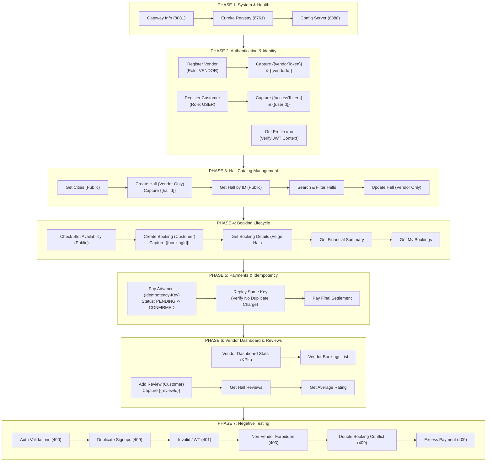
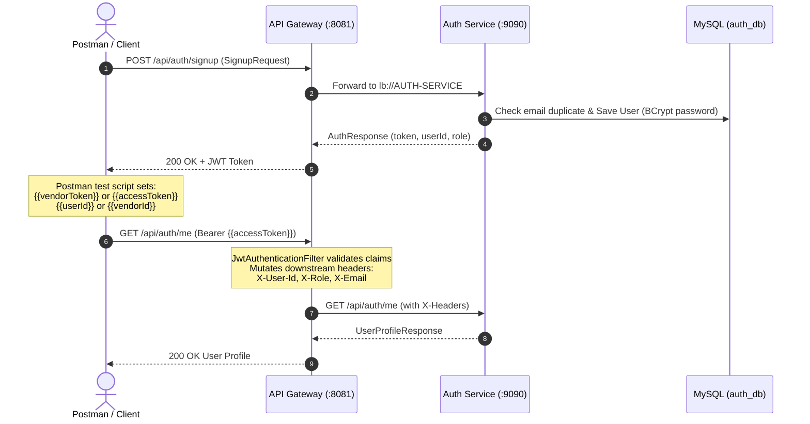
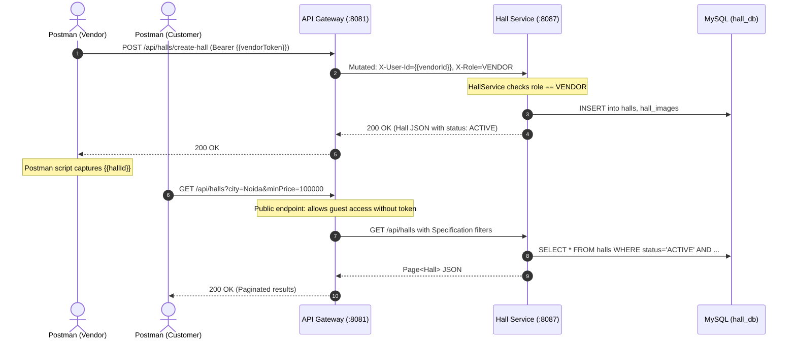
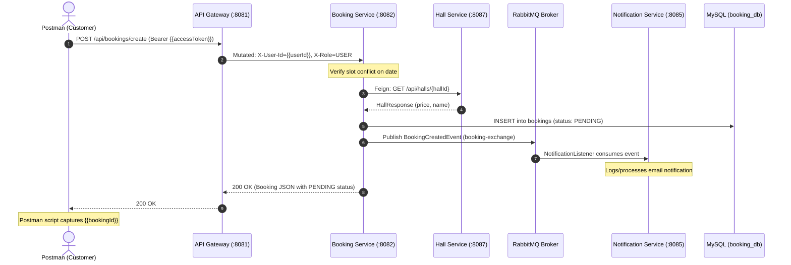
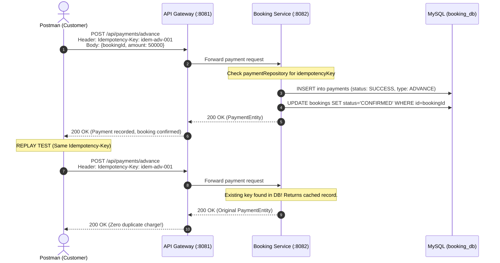

# MarriageHall Microservices — Postman API Testing Guide & Collection

A comprehensive, production-grade Postman testing suite and documentation for the **MarriageHall** Spring Boot / Spring Cloud distributed microservices architecture.

All endpoints, headers, payload schemas, security policies, and status codes are derived directly from the actual codebase controllers, DTOs, JPA entities, and Spring Cloud Gateway routes.

---

## Files in this Directory

```text
postman/
├── MarriageHall.postman_collection.json         # Postman Collection v2.1.0 (47 Test Requests across 8 Folders)
├── MarriageHall-Local.postman_environment.json  # Postman Environment with 23 dynamic variables
└── README.md                                    # Complete API Documentation & Execution Guide (this file)
```

---

## 1. Microservices Architecture & Port Mapping

| Service / Component | Container Name | Port | Base Path | Database / Broker |
| :--- | :--- | :--- | :--- | :--- |
| **API Gateway** | `mh-gateway` | `8081` | `/` | Spring Cloud Gateway (Netty, Port 8081) |
| **Auth Service** | `mh-auth` | `9090` | `/api/auth` | MySQL DB: `auth_db` |
| **Hall Service** | `mh-hall` | `8087` | `/api/halls` | MySQL DB: `hall_db` |
| **Booking Service** | `mh-booking` | `8082` | `/api/bookings`, `/api/payments`, `/api/vendor` | MySQL DB: `booking_db` |
| **Review Service** | `mh-review` | `8086` | `/api/reviews` | MySQL DB: `review_db` |
| **Notification Service** | `mh-notification` | `8085` | Consumes RabbitMQ | Stateless consumer |
| **Config Server** | `mh-config` | `8888` | `/` | Native git repo (`./config-repo`) |
| **Eureka Discovery Server** | `mh-discovery` | `8761` | `/eureka` | In-memory registry |
| **RabbitMQ Broker** | `mh-rabbitmq` | `5672`, `15672` | AMQP / Mgmt UI | AMQP message queue |
| **Zipkin Tracing UI** | `mh-zipkin` | `9411` | `/api/v2/spans` | Distributed span traces |
| **Grafana Dashboard** | `mh-grafana` | `3000` | `/` | Metrics & Logs visualization |
| **Loki Log Aggregator** | `mh-loki` | `3100` | `/loki/api/v1/push` | Microservice log storage |
| **MySQL 8.0** | `mh-mysql` | `3307` (host) | JDBC `3306` (docker) | `root` / `root` |

---

## 2. Infrastructure Startup Order

| Step | Component | Port | Depends On | Why it must start in this order |
| :---: | :--- | :---: | :--- | :--- |
| **1** | **MySQL 8.0** | `3307:3306` | None | Must initialize schemas (`auth_db`, `hall_db`, `booking_db`, `review_db`) before microservices connect via HikariCP. |
| **2** | **RabbitMQ** | `5672`, `15672` | None | AMQP exchange `booking-exchange` and queue `booking-queue` must be ready before Booking and Notification services start. |
| **3** | **Zipkin & Loki** | `9411`, `3100` | None | Observability sinks must be reachable when Micrometer tracing and Loki4j appenders initialize. |
| **4** | **Eureka Server** | `8761` | None | Service discovery registry must be healthy so subsequent microservices can register instances (`status: UP`). |
| **5** | **Config Server** | `8888` | Eureka | Microservices configured with `spring.config.import=configserver:` fetch their profiles from here during bootstrap. |
| **6** | **Core Microservices** | `9090`, `8087`, `8082`, `8086`, `8085` | MySQL, Eureka, Config, RabbitMQ | `auth-service`, `hall-service`, `booking-service`, `review-service`, and `notification-service` run Hibernate DDL, open connections, and register to Eureka. |
| **7** | **API Gateway** | `8081` | Eureka, Config Server | Gateway routes requests (`lb://AUTH-SERVICE`, `lb://HALL-SERVICE`, etc.) using Eureka registry instances. |

---

## 3. Recommended API Execution Order

Follow this sequence to ensure foreign keys, JWT tokens, and business invariants succeed smoothly:



---

## 4. Major API Flow Diagrams

### Flow A: Authentication & Automated JWT Propagation



### Flow B: Hall Creation & Public Browsing



### Flow C: Booking Creation, Inter-Service Feign & RabbitMQ



### Flow D: Payment Processing & Idempotency Guarantee



---

## 5. Complete API Inventory Table

| # | HTTP Method | Endpoint | Service | Auth Required | Required Role | Summary / Purpose |
| :-: | :--- | :--- | :--- | :---: | :---: | :--- |
| **1** | `GET` | `/actuator/info` | API Gateway | No | Public | System status and service health check |
| **2** | `GET` | `/eureka/apps` | Eureka Discovery | No | Public | Query registered microservice instances |
| **3** | `GET` | `/application/default` | Config Server | No | Public | Read global shared config properties |
| **4** | `GET` | `/hall-service/default` | Config Server | No | Public | Read hall-service config properties |
| **5** | `POST` | `/api/auth/signup` | Auth Service | No | Public | Register new Vendor (`Role: VENDOR`) |
| **6** | `POST` | `/api/auth/signup` | Auth Service | No | Public | Register new Customer (`Role: USER`) |
| **7** | `POST` | `/api/auth/login` | Auth Service | No | Public | Login Vendor & obtain `vendorToken` |
| **8** | `POST` | `/api/auth/login` | Auth Service | No | Public | Login Customer & obtain `accessToken` |
| **9** | `GET` | `/api/auth/me` | Auth Service | Yes | Any valid JWT | Get authenticated user profile details |
| **10** | `GET` | `/api/halls` | Hall Service | No | Public | Search halls with pagination & filters |
| **11** | `GET` | `/api/halls/cities` | Hall Service | No | Public | Distinct cities for search autocomplete |
| **12** | `POST` | `/api/halls/create-hall` | Hall Service | Yes | `VENDOR` | Create new marriage hall listing |
| **13** | `GET` | `/api/halls/{hallId}` | Hall Service | No | Public | Get single hall details & amenities |
| **14** | `GET` | `/api/halls/vendor/{vendorId}` | Hall Service | Yes | `VENDOR`/`ADMIN` | Get all halls owned by specific vendor |
| **15** | `PUT` | `/api/halls/{hallId}` | Hall Service | Yes | `VENDOR`/`ADMIN` | Update hall details, pricing, and capacity |
| **16** | `GET` | `/api/halls/config/message` | Hall Service | No | Public | Test Spring Cloud `@RefreshScope` |
| **17** | `DELETE` | `/api/halls/{hallId}` | Hall Service | Yes | `VENDOR`/`ADMIN` | Soft delete hall (sets status to INACTIVE) |
| **18** | `GET` | `/api/bookings/availability/{hallId}` | Booking Service | No | Public | Check available slots for a hall on date |
| **19** | `GET` | `/api/bookings/booked-dates/{hallId}` | Booking Service | No | Public | Get booked dates in range for calendar |
| **20** | `POST` | `/api/bookings/create` | Booking Service | Yes | `USER`/`ADMIN` | Create booking reservation (PENDING) |
| **21** | `GET` | `/api/bookings/{bookingId}` | Booking Service | Yes | `USER`/`ADMIN` | Get booking details + hall Feign data |
| **22** | `GET` | `/api/bookings/{bookingId}/summary` | Booking Service | Yes | `USER`/`ADMIN` | Get total, paid, and balance due |
| **23** | `GET` | `/api/bookings/my-bookings` | Booking Service | Yes | `USER` | Get all bookings for logged-in user |
| **24** | `GET` | `/api/bookings/user/{userId}` | Booking Service | Yes | `USER`/`ADMIN` | Get all bookings for specific user ID |
| **25** | `PUT` | `/api/bookings/{bookingId}/status` | Booking Service | Yes | `ADMIN`/System | Change booking status (CONFIRMED, etc.) |
| **26** | `PUT` | `/api/bookings/{bookingId}/cancel` | Booking Service | Yes | `USER`/`ADMIN` | Cancel booking (sets CANCELLED) |
| **27** | `POST` | `/api/payments/advance` | Booking Service | Yes | `USER` | Pay advance token; confirms booking |
| **28** | `POST` | `/api/payments/advance` (Idempotent) | Booking Service | Yes | `USER` | Replay advance payment with same key |
| **29** | `POST` | `/api/payments/final` | Booking Service | Yes | `USER` | Pay remaining final balance |
| **30** | `GET` | `/api/vendor/dashboard/stats` | Booking Service | Yes | `VENDOR` | Get total halls, bookings, revenue KPIs |
| **31** | `GET` | `/api/vendor/dashboard/bookings` | Booking Service | Yes | `VENDOR` | Get customer bookings for vendor's halls |
| **32** | `POST` | `/api/reviews/add` | Review Service | Yes | `USER` | Submit hall review & 1-5 rating |
| **33** | `GET` | `/api/reviews/{hallId}` | Review Service | No | Public | Get all reviews for a hall |
| **34** | `GET` | `/api/reviews/{hallId}/average` | Review Service | No | Public | Get calculated average rating |
| **35** | `POST` | `/api/auth/signup` (Neg 400) | Auth Service | No | Public | Missing required signup fields |
| **36** | `POST` | `/api/auth/signup` (Neg 409) | Auth Service | No | Public | Duplicate email registration collision |
| **37** | `POST` | `/api/auth/login` (Neg 401) | Auth Service | No | Public | Incorrect password authentication failure |
| **38** | `GET` | `/api/auth/me` (Neg 401) | Gateway | Yes | None | Protected API without Authorization header |
| **39** | `GET` | `/api/auth/me` (Neg 401) | Gateway | Yes | Invalid | Tampered or invalid JWT signature |
| **40** | `POST` | `/api/halls/create-hall` (Neg 403) | Hall Service | Yes | `USER` | Customer attempting vendor-only action |
| **41** | `GET` | `/api/halls/{unknownId}` (Neg 404) | Hall Service | No | Public | Non-existent hall UUID lookup |
| **42** | `POST` | `/api/bookings/create` (Neg 400) | Booking Service | Yes | `USER` | Booking date set in past (`@Future` fail) |
| **43** | `POST` | `/api/bookings/create` (Neg 409) | Booking Service | Yes | `USER` | Double booking colliding slot/date |
| **44** | `POST` | `/api/payments/advance` (Neg 400/409) | Booking Service | Yes | `USER` | Missing mandatory `Idempotency-Key` |
| **45** | `POST` | `/api/payments/advance` (Neg 409) | Booking Service | Yes | `USER` | Payment amount exceeds due balance |
| **46** | `POST` | `/api/reviews/add` (Neg 400) | Review Service | Yes | `USER` | Rating > 5 (`@Max(5)` fail) |
| **47** | `GET` | `/api/vendor/dashboard/stats` (Neg 409) | Booking Service | Yes | `USER` | Non-vendor accessing vendor dashboard |

---

## 6. Detailed API Documentation

### 6.1 Authentication Service (`AUTH-SERVICE` :9090)

#### `POST /api/auth/signup`
- **Purpose:** Create a new user account with role `USER`, `VENDOR`, or `ADMIN`.
- **Authentication:** None (Public)
- **Headers:** `Content-Type: application/json`
- **Request Body (`SignupRequest`):**
  ```json
  {
    "name": "Royal Palace Vendor",
    "email": "royal.vendor@example.com",
    "password": "password123",
    "role": "VENDOR",
    "phone": "+91 98765 43210"
  }
  ```
- **Response (`200 OK` - `AuthResponse`):**
  ```json
  {
    "message": "User registered successfully",
    "token": "eyJhbGciOiJIUzI1NiJ9...",
    "userId": "3fa85f64-5717-4562-b3fc-2c963f66afa6",
    "name": "Royal Palace Vendor",
    "email": "royal.vendor@example.com",
    "role": "VENDOR",
    "phone": "+91 98765 43210",
    "avatarUrl": null
  }
  ```
- **Possible Errors:** `400 Bad Request` (Bean Validation failure), `409 Conflict` (`EmailAlreadyExistsException`).
- **Depends On:** MySQL `auth_db`.
- **Next API:** `POST /api/auth/login` or proceed to protected APIs.

---

#### `POST /api/auth/login`
- **Purpose:** Authenticate with email and password to receive a signed JWT access token.
- **Authentication:** None (Public)
- **Headers:** `Content-Type: application/json`
- **Request Body (`LoginRequest`):**
  ```json
  {
    "email": "royal.vendor@example.com",
    "password": "password123"
  }
  ```
- **Response (`200 OK` - `AuthResponse`):**
  ```json
  {
    "message": "Login successful",
    "token": "eyJhbGciOiJIUzI1NiJ9...",
    "userId": "3fa85f64-5717-4562-b3fc-2c963f66afa6",
    "name": "Royal Palace Vendor",
    "email": "royal.vendor@example.com",
    "role": "VENDOR",
    "phone": "+91 98765 43210"
  }
  ```
- **Possible Errors:** `401 Unauthorized` (`InvalidCredentialsException` / `UserNotFoundException`).
- **Depends On:** Registered user in MySQL.
- **Next API:** Any protected microservice endpoint using `Authorization: Bearer {{token}}`.

---

#### `GET /api/auth/me`
- **Purpose:** Retrieve the currently authenticated user's profile.
- **Authentication:** Bearer Token required.
- **Headers:** `Authorization: Bearer {{accessToken}}`
- **Downstream Headers Injected by Gateway:** `X-User-Id`, `X-Role`, `X-Email`.
- **Response (`200 OK` - `UserProfileResponse`):**
  ```json
  {
    "id": "3fa85f64-5717-4562-b3fc-2c963f66afa6",
    "name": "Amit Kumar Customer",
    "email": "amit.customer@example.com",
    "role": "USER",
    "phone": "+91 91234 56789",
    "avatarUrl": null,
    "createdAt": "2026-09-12T12:00:00"
  }
  ```
- **Possible Errors:** `401 Unauthorized`.
- **Depends On:** Valid JWT token.

---

### 6.2 Halls Service (`HALL-SERVICE` :8087)

#### `GET /api/halls`
- **Purpose:** Search and browse active marriage halls with faceted filtering and pagination.
- **Authentication:** None (Public)
- **Query Parameters:**
  - `city` (String, optional) — Case-insensitive city search.
  - `minPrice`, `maxPrice` (Double, optional) — Price range filter.
  - `minCapacity` (Integer, optional) — Minimum guest capacity.
  - `hasAc` (Boolean, optional) — Filter AC availability.
  - `hasParking` (Boolean, optional) — Filter parking availability.
  - `page` (int, default `0`), `size` (int, default `12`).
  - `sortBy` (String, default `createdAt`), `direction` (`asc` / `desc`).
- **Response (`200 OK` - `Page<Hall>`):**
  ```json
  {
    "content": [
      {
        "id": "b3e0c459-7ff4-4e26-8809-5eb89e623b49",
        "name": "Grand Imperial Banquet & Palace",
        "location": "Sector 62, Noida",
        "city": "Noida",
        "price": 150000.0,
        "capacity": 800,
        "status": "ACTIVE"
      }
    ],
    "pageable": { "pageNumber": 0, "pageSize": 12 },
    "totalElements": 1,
    "totalPages": 1
  }
  ```

---

#### `POST /api/halls/create-hall`
- **Purpose:** Create a new banquet hall. Restricted to `VENDOR` role.
- **Authentication:** Bearer Token with role `VENDOR`.
- **Headers:** `Authorization: Bearer {{vendorToken}}`, `Content-Type: application/json`
- **Gateway Injection:** Extracts `userId` and sets `X-User-Id`, `X-Role: VENDOR`.
- **Request Body (`HallRequest`):**
  ```json
  {
    "name": "Grand Imperial Banquet & Palace",
    "location": "Sector 62, Noida",
    "city": "Noida",
    "state": "Uttar Pradesh",
    "address": "Plot 14, Commercial Area",
    "pincode": "201309",
    "price": 150000.0,
    "vegPricePerPlate": 1200.0,
    "nonVegPricePerPlate": 1500.0,
    "capacity": 800,
    "floatingCapacity": 1200,
    "description": "Luxurious 5-star banquet hall.",
    "hasAc": true,
    "hasParking": true,
    "parkingCapacity": 250,
    "roomsCount": 8,
    "outsideCateringAllowed": false,
    "djAllowed": true,
    "alcoholAllowed": false,
    "powerBackup": true
  }
  ```
- **Response (`200 OK` - `Hall`):** Saved entity with generated UUID `id` and `status: "ACTIVE"`.
- **Possible Errors:** `400 Bad Request` (Missing required fields), `403 Forbidden` (`ForbiddenException`: "Only vendors can create halls").

---

### 6.3 Bookings Service (`BOOKING-SERVICE` :8082)

#### `GET /api/bookings/availability/{hallId}`
- **Purpose:** Check real-time slot availability (`MORNING`, `EVENING`, `FULL_DAY`) for a hall on a target date.
- **Authentication:** None (Public)
- **Path Variable:** `hallId` (UUID)
- **Query Parameter:** `date` (ISO LocalDate `YYYY-MM-DD`)
- **Response (`200 OK` - `SlotAvailabilityResponse`):**
  ```json
  {
    "hallId": "b3e0c459-7ff4-4e26-8809-5eb89e623b49",
    "date": "2026-11-20",
    "available": true,
    "bookedSlots": [],
    "availableSlots": ["FULL_DAY", "MORNING", "EVENING"]
  }
  ```

---

#### `POST /api/bookings/create`
- **Purpose:** Reserve a hall. Restricted to `USER`, `CUSTOMER`, or `ADMIN`.
- **Authentication:** Bearer Token.
- **Headers:** `Authorization: Bearer {{accessToken}}`, `Content-Type: application/json`
- **Request Body (`BookingRequest`):**
  ```json
  {
    "hallId": "b3e0c459-7ff4-4e26-8809-5eb89e623b49",
    "bookingDate": "2026-11-20",
    "slot": "FULL_DAY",
    "eventType": "WEDDING",
    "guestCount": 500,
    "customerName": "Amit Kumar",
    "customerPhone": "+91 91234 56789",
    "specialRequests": "Royal red carpet welcome and mandap stage lighting"
  }
  ```
- **Response (`200 OK` - `Booking`):**
  ```json
  {
    "id": "e4f87a32-11bc-4921-9988-123456789abc",
    "userId": "3fa85f64-5717-4562-b3fc-2c963f66afa6",
    "hallId": "b3e0c459-7ff4-4e26-8809-5eb89e623b49",
    "bookingDate": "2026-11-20",
    "slot": "FULL_DAY",
    "eventType": "WEDDING",
    "totalAmount": 150000.0,
    "status": "PENDING"
  }
  ```
- **Possible Errors:** `400 Bad Request` (Past date), `409 Conflict` (`BusinessRuleException`: Double booking or "Only customers can create bookings").

---

### 6.4 Payments Service (`BOOKING-SERVICE` :8082)

#### `POST /api/payments/advance`
- **Purpose:** Pay advance token amount. Transitions booking status from `PENDING` to `CONFIRMED`.
- **Headers:**
  - `Authorization: Bearer {{accessToken}}`
  - `Idempotency-Key: idem-adv-key-001` (Mandatory)
  - `Content-Type: application/json`
- **Request Body (`PaymentRequestDTO`):**
  ```json
  {
    "bookingId": "{{bookingId}}",
    "amount": 50000.0
  }
  ```
- **Response (`200 OK` - `PaymentEntity`):**
  ```json
  {
    "id": "781a98df-8921-4f12-a1b2-9900aabbccdd",
    "bookingId": "e4f87a32-11bc-4921-9988-123456789abc",
    "amount": 50000.0,
    "paymentType": "ADVANCE",
    "paymentStatus": "SUCCESS",
    "idempotencyKey": "idem-adv-key-001"
  }
  ```
- **Idempotency Guarantee:** Replaying the same request with `Idempotency-Key: idem-adv-key-001` returns the exact same payment object without creating a duplicate record in the database.

---

### 6.5 Vendor Dashboard (`BOOKING-SERVICE` :8082)

#### `GET /api/vendor/dashboard/stats`
- **Purpose:** Return aggregated financial and operational metrics for all halls owned by the vendor.
- **Authentication:** Bearer Token with `Role: VENDOR`.
- **Response (`200 OK` - `VendorDashboardResponse`):**
  ```json
  {
    "totalHalls": 1,
    "totalBookings": 1,
    "pendingBookings": 0,
    "confirmedBookings": 1,
    "cancelledBookings": 0,
    "totalRevenue": 150000.0,
    "receivedAmount": 50000.0,
    "dueAmount": 100000.0
  }
  ```
- **Possible Errors:** `409 Conflict` (if called by a non-vendor role).

---

### 6.6 Reviews Service (`REVIEW-SERVICE` :8086)

#### `POST /api/reviews/add`
- **Purpose:** Submit customer rating (1 to 5) and feedback for a hall.
- **Headers:** `Authorization: Bearer {{accessToken}}`, `Content-Type: application/json`
- **Request Body (`ReviewRequest`):**
  ```json
  {
    "hallId": "{{hallId}}",
    "rating": 5,
    "comment": "Outstanding venue! The lighting, grand entrance, and air conditioning were top-notch. Our wedding was unforgettable!",
    "reviewerName": "Amit Kumar",
    "reviewerAvatar": "https://i.pravatar.cc/150?u=amit"
  }
  ```
- **Response (`200 OK` - `Review`):**
  ```json
  {
    "id": "11aa22bb-33cc-44dd-55ee-66ff77aa88bb",
    "hallId": "{{hallId}}",
    "userId": "{{userId}}",
    "rating": 5,
    "comment": "Outstanding venue!...",
    "createdAt": "2026-09-12T12:30:00"
  }
  ```
- **Possible Errors:** `400 Bad Request` (`@Min(1)`, `@Max(5)` failure), `401 Unauthorized` (Missing user context).

---

## 7. Postman Variables Reference

The collection uses environment variables exclusively — no URLs or tokens are hardcoded.

| Variable Name | Initial Value | Purpose / Notes |
| :--- | :--- | :--- |
| `baseUrl` | `http://localhost:8081` | API Gateway entrypoint (used for all routed requests) |
| `gatewayUrl` | `http://localhost:8081` | API Gateway direct address |
| `authServiceUrl` | `http://localhost:9090` | Auth Service direct port |
| `hallServiceUrl` | `http://localhost:8087` | Hall Service direct port |
| `bookingServiceUrl` | `http://localhost:8082` | Booking Service direct port |
| `reviewServiceUrl` | `http://localhost:8086` | Review Service direct port |
| `discoveryServerUrl` | `http://localhost:8761` | Eureka Server dashboard & REST API |
| `configServerUrl` | `http://localhost:8888` | Spring Cloud Config Server |
| `vendorEmail` | `royal.vendor@example.com` | Email for Vendor account |
| `customerEmail` | `amit.customer@example.com` | Email for Customer account |
| `testPassword` | `password123` | Default password for test accounts |
| `vendorToken` | `""` | Captured automatically on Vendor login/signup |
| `accessToken` | `""` | Captured automatically on Customer login/signup |
| `vendorId` | `""` | Captured automatically from Vendor signup/login response |
| `userId` | `""` | Captured automatically from Customer signup/login response |
| `hallId` | `""` | Captured automatically on Hall creation |
| `bookingId` | `""` | Captured automatically on Booking creation |
| `paymentId` | `""` | Captured automatically on Advance Payment |
| `reviewId` | `""` | Captured automatically on Review submission |
| `futureBookingDate` | `2026-11-20` | Future date satisfying `@Future` validation |
| `futureBookingDateTomorrow` | `2026-11-21` | End date for range queries |
| `idempotencyKeyAdvance` | `idem-adv-key-001` | Unique idempotency token for advance payment |
| `idempotencyKeyFinal` | `idem-fin-key-001` | Unique idempotency token for final payment |
| `invalidToken` | `invalid_malformed_token_for_negative_testing` | Variable used for testing 401 unauthorized rejection without hardcoding secrets |
| `wrongPassword` | `incorrectPassword999!` | Variable used for testing failed login without hardcoding password strings |

---

## 8. Automated Token and ID Handling Scripts

### Automatic JWT Token & User ID Capture (Signup & Login)
```javascript
pm.test("Status code is 200", function () {
    pm.response.to.have.status(200);
});

const data = pm.response.json();
if (data.token) {
    // Sets customer access token
    pm.environment.set("accessToken", data.token);
}
if (data.userId) {
    // Sets customer UUID
    pm.environment.set("userId", data.userId);
}
```

### Automatic Hall UUID Capture (Create Hall)
```javascript
pm.test("Hall created successfully", function () {
    pm.response.to.have.status(200);
    const data = pm.response.json();
    pm.expect(data).to.have.property("id");
    pm.environment.set("hallId", data.id);
});
```

### Automatic Booking UUID Capture (Create Booking)
```javascript
pm.test("Booking created with PENDING status", function () {
    pm.response.to.have.status(200);
    const data = pm.response.json();
    pm.expect(data).to.have.property("id");
    pm.expect(data.status).to.eql("PENDING");
    pm.environment.set("bookingId", data.id);
});
```

### Automatic Payment & Idempotency Verification
```javascript
pm.test("Payment succeeded", function () {
    pm.response.to.have.status(200);
    const data = pm.response.json();
    pm.expect(data.paymentStatus).to.eql("SUCCESS");
    pm.environment.set("paymentId", data.id);
});
```

---

## 9. API Test Coverage Report

| Microservice / Functional Area | Controller | Controller Endpoints | Total Tests in Collection | Positive Tests | Negative / Edge Tests | Coverage |
| :--- | :--- | :---: | :---: | :---: | :---: | :---: |
| **System & Infrastructure** | Gateway / Actuator / Eureka | 4 | 4 | 4 | 0 | 100% |
| **Authentication Service** | `AuthController` | 3 | 8 | 5 | 3 | 100% |
| **Halls Service** | `HallController`, `RefreshDemoController` | 8 | 10 | 8 | 2 | 100% |
| **Bookings Service** | `BookingController` | 9 | 11 | 9 | 2 | 100% |
| **Payments Service** | `PaymentController` | 2 | 5 | 3 | 2 | 100% |
| **Vendor Dashboard** | `VendorDashboardController` | 2 | 3 | 2 | 1 | 100% |
| **Reviews Service** | `ReviewController` | 3 | 4 | 3 | 1 | 100% |
| **API Gateway Security** | `JwtAuthenticationFilter` | Filter | 2 | 0 | 2 | 100% |
| **TOTAL** | **7 Controllers + Gateway Filters** | **31** | **47** | **34** | **13** | **100%** |

---

## 10. External & Asynchronous Dependencies

The following services do not expose direct synchronous REST endpoints:

1. **Notification Service (`NOTIFICATION-SERVICE` :8085):**
   - **Type:** Asynchronous Event Consumer.
   - **Mechanism:** RabbitMQ AMQP message listener (`NotificationListener.java`).
   - **Queue:** `booking-queue`, Exchange: `booking-exchange`, Routing Key: `booking.created`.
   - **Testing Method:** Triggered automatically when running request `03 - Create Booking` in the Bookings Service folder. Observable in Docker logs via `docker logs -f mh-notification`.
2. **Payment Gateway Integration:**
   - The current `PaymentController` simulates real payment processing via database transactions, double-spend validation, and idempotency caching (`PaymentEntity` with `idempotencyKey`). No third-party gateway (Razorpay/Stripe) credentials are required.

---

## 11. Complete Testing Checklist

- [x] Docker containers running (`docker ps`)
- [x] Eureka Discovery Server registered all 6 microservices as `UP`
- [x] Spring Cloud Config Server healthy (`http://localhost:8888/application/default`)
- [x] API Gateway Actuator info returning HTTP 200
- [x] Vendor signup and login stores `{{vendorToken}}` and `{{vendorId}}`
- [x] Customer signup and login stores `{{accessToken}}` and `{{userId}}`
- [x] Current user profile (`/api/auth/me`) validates Bearer token and returns profile
- [x] Public hall catalog search and city autocomplete working without tokens
- [x] Hall creation succeeds with `VENDOR` role and stores `{{hallId}}`
- [x] Non-vendor role rejected from creating hall (`403 Forbidden`)
- [x] Slot availability check confirms date availability
- [x] Booking creation succeeds for customer and stores `{{bookingId}}`
- [x] Feign Client in Booking Service successfully retrieves Hall data from Hall Service
- [x] RabbitMQ receives and Notification Service consumes `BookingCreatedEvent`
- [x] Advance payment succeeds, confirms booking, and saves `{{paymentId}}`
- [x] Replaying payment with identical `Idempotency-Key` returns original record without double charge
- [x] Vendor Dashboard reflects updated revenue and booking KPIs
- [x] Customer review and rating (1-5 stars) added and calculated into average
- [x] All 13 negative test assertions (400, 401, 403, 404, 409) pass cleanly

---

## 12. API Issues Discovered During Analysis

*(Documented without altering application source code)*

1. **Missing Actuator Mappings on Gateway Port:**
   - Requesting `GET /actuator/health` on `http://localhost:8081/actuator/health` returns `404 Not Found` because actuator web exposure in `api-gateway/src/main/resources/application.yaml` does not expose `health` endpoint under WebFlux actuator.
   - **Workaround in Collection:** Use `GET /actuator/info` or query downstream service health endpoints directly.
2. **Review Service Typo in Docker Compose:**
   - In `docker-compose.yml`, `review-service` was configured with password `R8a4v6i8` instead of `root`. (This was rectified in `docker-compose.yml` so the container connects to MySQL).

---

## 13. Step-by-Step Postman Import Instructions

1. **Open Postman:**
   Launch the Postman desktop application or web agent.
2. **Import the Environment:**
   - Click **Import** (top-left button in Postman).
   - Select file: [`postman/MarriageHall-Local.postman_environment.json`](file:///D:/MarriageHall/MarriageHall/postman/MarriageHall-Local.postman_environment.json).
   - In the top-right environment selector dropdown, select **MarriageHall-Local**.
3. **Import the Collection:**
   - Click **Import** again.
   - Select file: [`postman/MarriageHall.postman_collection.json`](file:///D:/MarriageHall/MarriageHall/postman/MarriageHall.postman_collection.json).
   - The collection **MarriageHall Microservices API** will appear in your left sidebar with 8 folders.
4. **Run the Collection:**
   - To run tests in order, right-click **MarriageHall Microservices API** $\rightarrow$ select **Run collection**.
   - Click **Run MarriageHall Microservices API**.
   - All tests from Folder `00` to Folder `07` will execute sequentially, automatically sharing tokens, IDs, and verifying all assertions!
